# The Basics

This tutorial introduces the basics of developing with Stretch. It'll cover the concepts and development tools you'll come across, including:

 1. the robot's operating system
 2. where important files live
 3. using the terminal

## Operating System

Stretch's onboard computer is running a desktop Linux operating system called Ubuntu. When you power up Stretch, you'll see the desktop. You'll find Ubuntu's desktop has the same elements as Windows or Mac OS desktops.

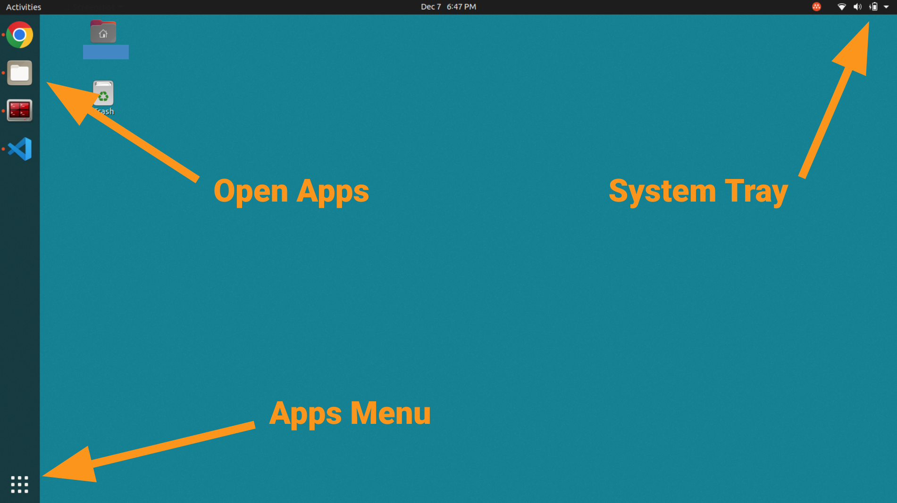

### Connecting to Wifi

The system tray shows whether Stretch is connected to the internet.

 - Connected via Wifi: 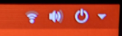
 - Connected via Ethernet: 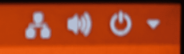

To connect via Wifi to a new network, first open Wifi settings.

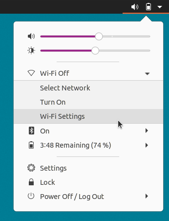

Click on your Wifi network and fill out the connection form.

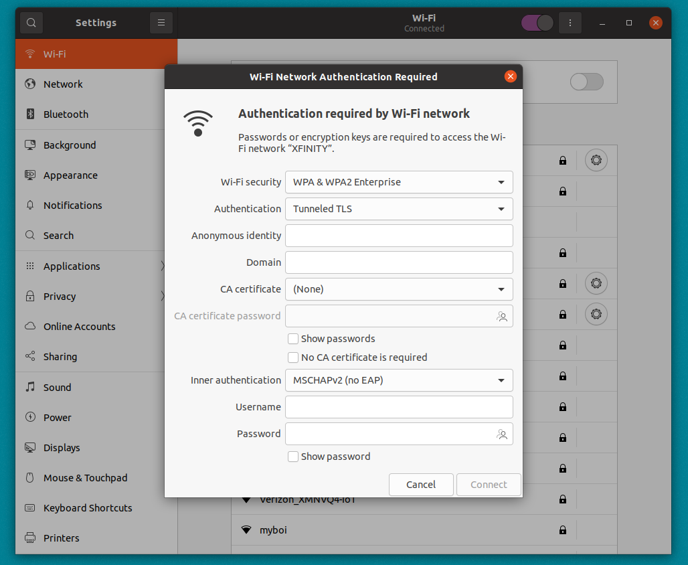

### Desktop Applications

Since Ubuntu is a desktop operating system, you can download any applications you need (e.g. Slack, Discord). Ubuntu has an app store called "Ubuntu Software" that makes the install easy. You can also find software online.

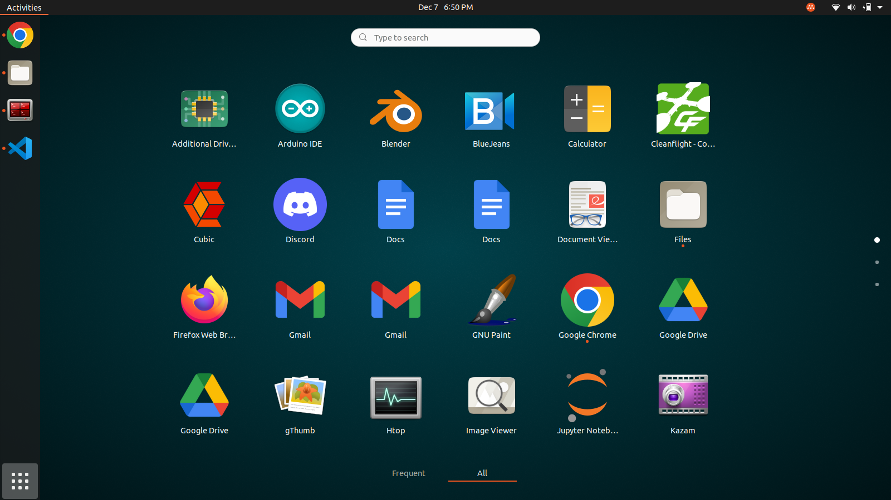

Some of the preinstalled applications:

 - **Web Browser:** Firefox
 - **Code Editors:** Visual Studio Code, PyCharm, 
 - **Media Player:** VLC
 - **File Explorer:** Files

### User Accounts

The default user account is called Hello Robot with the username `hello-robot`. This is also the admin account.

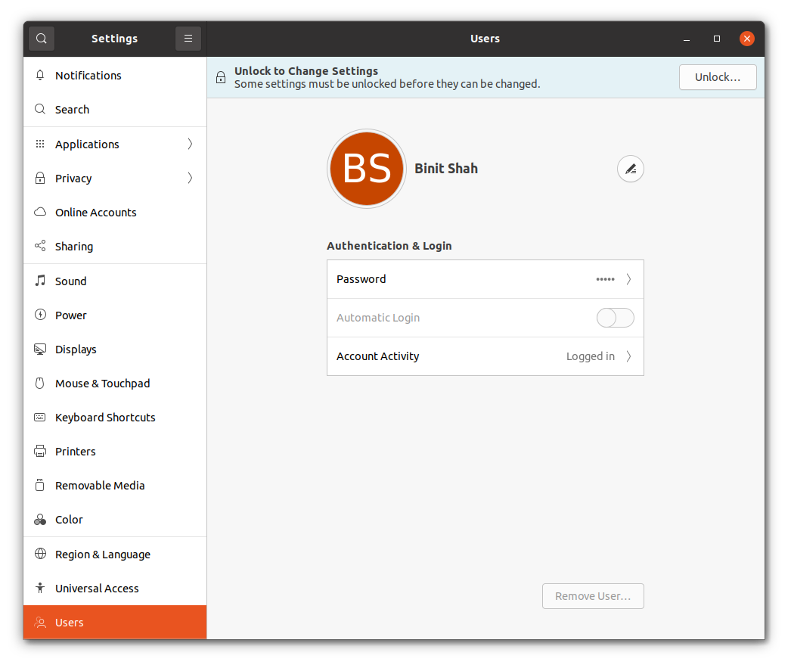


#### Changing your Credentials

The password for the Hello Robot account is printed on the welcome sheet included in the box with Stretch. If you're having trouble finding it, reach out to [support](mailto:support@hello-robot.com). We recommend changing the password for this account.

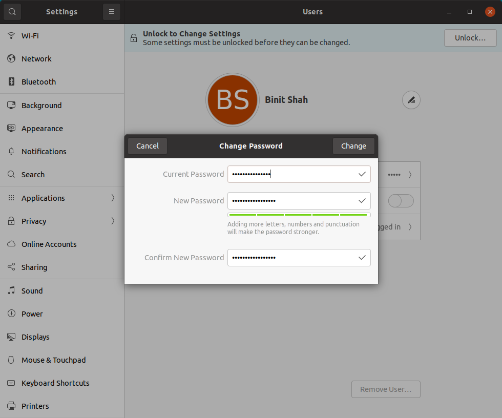

#### Adding New Users

If you're sharing Stretch with other developers, it can be helpful to create separate accounts for yourself and your team members. Check out the [Adding a New User](https://docs.hello-robot.com/0.3/installation/add_new_user/) guide.

## Where Files Live

In this section, we'll cover where to find the files that are important for developing code.


### The Home Folder

Your account's files all live under the home folder. This directory contains standard organizational folders like `Documents` or `Downloads`, as well as folders that are unique to Stretch's SDK, such as:

 - `stretch_user`: The [Stretch User folder](#the-stretch-user-folder) is required to be present in the home directory for Stretch's SDK to work correctly. It contains calibration data unique to your robot and assets (e.g. neural net checkpoints, maps for navigation, etc.) used by various programs. If you're missing this directory, reach out to support.
 - `ament_ws`: The Ament Workspace folder contains Stretch's ROS2 SDK. This directory will be covered in more detail in the [Using ROS 2 with Stretch](#TODO) tutorial. If this folder is missing, you may be using an older [robot distribution](../../../software/distributions/) and should consider upgrading.
 - `catkin_ws`: The Catkin Workspace folder contains Stretch's ROS1 SDK. If this folder exists, you may be using an older [robot distribution](../../../software/distributions/) and should consider upgrading.

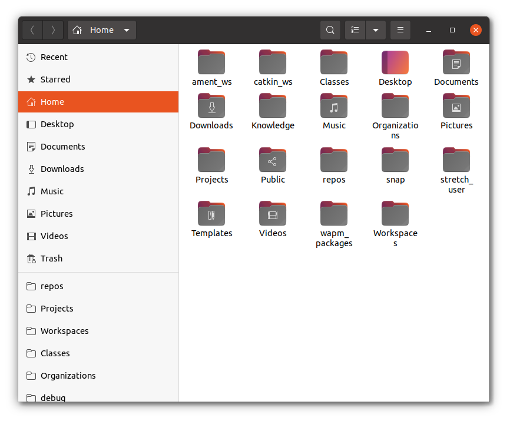

### The Stretch User Folder

The Stretch User folder contains calibration data unique to your robot and assets (e.g. neural net checkpoints, maps for navigation, etc.) used by various programs in Stretch's SDK. The directories in this folder are:

 - `stretch-yyy-xxxx`: This is the [robot calibration directory](#the-robot-calibration-folder). Its naming scheme is "stretch-" following by "re1" for a Stretch RE1, "re2" for a Stretch 2, or "se3" for a Stretch 3, finally followed by your robot's four digit serial number.
 - `stretch_deep_perception_models`: This directory contains open deep learning models from third parties, including object detection, head detection, facial landmarks detection, and human pose detection.
 - `maps`: This directory contains [occupancy maps](https://www.cs.cmu.edu/~16831-f14/notes/F14/16831_lecture06_agiri_dmcconac_kumarsha_nbhakta.pdf) that are to be used with the Stretch Nav2 ROS2 package.
 - `debug`: This directory contains debug output from the Stretch FUNMAP ROS2 package.
 - `log`: This directory contains logfiles from various Stretch programs.

### The Robot Calibration Folder

The naming scheme for the robot calibration directory is `stretch-yyy-xxxx`, where "stretch-" is followed by "re1" for a Stretch RE1, "re2" for a Stretch 2, or "se3" for a Stretch 3, and finally followed by your robot's four digit serial number. For example, a Stretch 3 with serial number 3001 would be called `stretch-se3-3001`. The important directories in this folder are:

 - `calibration_ros`: This folder contains calibrated URDFs. The concepts of URDFs and calibrations will be covered in more detail in the [URDF Calibration](#urdf-calibration) section below.
 - `exported_urdf`: This folder contains a single calibrated standalone URDF of your Stretch. It will be covered in more detail in the [URDF Calibration](#urdf-calibration) section below.
 - `stretch_user_params.yaml`: This YAML file is for you to edit when you want to change a robot parameter. The [Advanced Features](#TODO) tutorial later in this series explains what robot parameters are and why you might want to change them.
 - `stretch_configuration_params.yaml`: This YAML file contains robot parameters unique to your robot. You don't want to edit this file.
 - `udev`: This folder contains a backup of the udev rules that enable Stretch's USB system to function correctly.

### The /etc/hello-robot Folder

This is a system level folder, available to all users on the robot. It contains:

 - `stretch-yyy-xxxx`: A system-wide backup of the [robot calibration directory](#the-robot-calibration-folder). Often, this is the oldest version since the Stretch User copy in each user account is updated by the SDK.

## Terminal

The terminal is an essential tool to developing on Stretch and on Linux systems in general. We'll become familiar with it in this section.

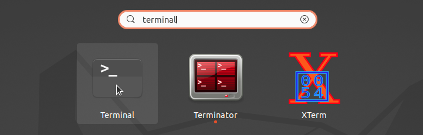

### Terminology

What exactly is a "terminal"? How does it relate to a "command prompt" or a "shell"? Let's clarify some terminology:

 - **Terminal Emulator** or "terminal", as it's often shortened to, is an application with a simple user interface: you type commands into the terminal, press enter to execute, and it prints out the results. On Windows, this application is called Command Prompt, and on MacOS and Ubuntu, it's called the Terminal.
    - 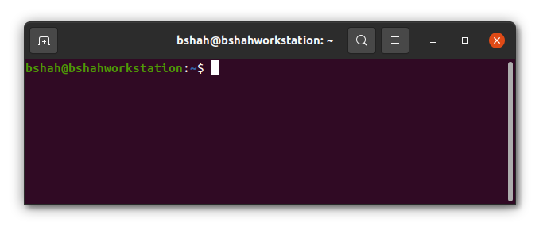
 - **Shell** is the program that actually interprets your commands, performs some action with them, and returns the output to the terminal. The shell on your Stretch is called [Bash](https://www.gnu.org/software/bash/). You may see the term "shell script", which refers to ".sh" or ".bash" files containing a series of commands written for Bash. Each shell has unique commands it accepts, so for example, commands for Bash won't work on a Windows shell. Fortunately, Bash is ubiquitous in computing, and learning its commands will be useful.
 - **Command Line** refers to the line on which you type the commands. It looks like this: . You'll notice the line contains some information before the blinking cursor. The format is usually `user@hostname:current_path$ type_command_here`. Here, the user is hello-robot, the hostname is stretch-re2-2002 (hostnames for Stretch robots follows the `stretch-yyy-xxxx` format described above), the current path/folder is `~` (the tilde represents the home directory), then the dollar sign, and finally, the cursor where you can type your commands. On this docs site, instructions will often provide commands for you to run in the terminal and you will see that they often have `$` before them. The dollar sign is signifying that what comes after is meant to be run on the command line (`$` is not actually part of the command).
    - For example, the command below is proceeded by a dollar sign, signifying `pwd` is a command line command.
      ```{.bash .shell-prompt .copy}
      pwd
      ```
 - **CLI** stands for "command line interface" and refers to the commands that a program makes available for you to use from the command line. The Stretch SDK comes with a CLI and the [Command Line Tools](./cli.md) tutorial explores this CLI in more detail.
 - **Git** is a program for keeping track of code changes and the git CLI is a popular method of collaboratively developing code.
 - **SSH** is a program that allows you to access the shell of another machine. You can "secure shell" or "ssh into" another machine using the SSH CLI. SSH is a popular method of running commands on Stretch while having no wires connected to the robot.

### Copying/Pasting to the Terminal

TODO - Ctrl C vs Ctrl Shift C

### The Change Directory Command

You can use the terminal to navigate the file system. When you open a terminal, you'll be in the home directory (often denoted by `~`). `cd` allows you to change directory to another directory. For example, you can go into the Stretch User directory using:

```{.bash .shell-prompt .copy}
cd stretch_user/
```

After typing or copying this command into the terminal, press ++enter++ to execute the command.

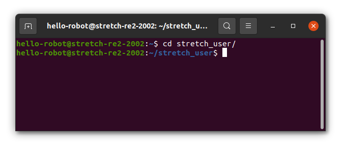

Your location among the directories is called a "file path" (e.g. the command above places you in the `~/stretch_user` filepath). You can return to the home directory at anytime by typing `cd` without any following arguments.

### Tab Completion

TODO

```
cd stre
```

### Commands

| Command   | Arguments                        | Description                                                                     | Examples                           |
|-----------|----------------------------------|---------------------------------------------------------------------------------|------------------------------------|
| **pwd**   | none                             | Print Working Directory - Prints out your current filepath                      | `pwd`                              |
| **ls**    | any number of optional filepaths | List - Used to display a list of all files and folders in the current directory | `ls`                               |
| **mkdir** | a single filepath                | Make New Directory - Used to create folders                                     | `mkdir temporary_folder`           |
| **rmdir** | a single filepath                | Remove Directory - Used to delete folders                                       | `rmdir temporary_folder`           |
| **touch** | a single filepath                | File Creation - Used to create empty files                                      | `touch temporary_file`             |
| **gedit** | a single filepath                | File Editor - Brings up a text editor                                           | `gedit temporary_file`             |
| **cat**   | a single filepath                | Concatenate - Prints out the contents of a file                                 | `cat temporary_file`               |
| **mv**    | two filepaths                    | Move - Used to move files between directories and/or rename files               | `mv temporary_file ~/stretch_user` |
| **rm**    | a single filepath                | Remove - Used to delete files                                                   | `rm ~/stretch_user/temporary_file` |

TODO - [Link to file system video here](https://youtu.be/Fqu2P2M092Y)

#### Flags

TODO

### APT Package Manager

APT is a system package manager used to install applications. It can install packages that have no GUI. For example, all ROS2 software is installed through APT. The APT CLI enables you to introspect and install new software onto Stretch. Since APT makes changes at the system level, it requires "super user access", which means each of the commands below is preceded by `sudo` and will ask for your password.

| Command         | Arguments                   | Description                                                   | Examples              |
|-----------------|-----------------------------|---------------------------------------------------------------|-----------------------|
| **apt list**    | none                        | List - Displays all of the packages installed                 | `sudo apt list`       |
| **apt update**  | none                        | Update - Refreshes APT's indices of packages available online | `sudo apt update`     |
| **apt upgrade** | none                        | Upgrade - Updates all APT packages to their latest versions   | `sudo apt upgrade`    |
| **apt install** | any number of package names | Install - Used to install new packages                        | `sudo apt install sl` |
| **apt remove**  | a single package name       | Uninstall - Used to remove packages                           | `sudo apt remove sl`  |

!!! note

    You may not be able to run APT immediately after a reboot as the OS may be running automatic updates in the background. You might see `Could not get lock /var/lib/dpkg/lock-frontend` when trying to use the APT CLI. Typically, waiting 10-20 minutes will allow you to use APT again.

### Git & GitHub

Git is a open source tool used for version control of source code. The Git CLI is a common way of interacting with Git repositories of code. Independently, GitHub is a popular website for publishing your Git repositories, and GitHub's features facilitate collaborative development online. At Hello Robot, we use both of these tools in our development flow (see the [Contributing](../../../software/contributing/) guide for info on our Github repos). Github has published a great [quick start](https://docs.github.com/en/get-started/quickstart/hello-world) tutorial covering Git's CLI and GitHub's features, so it's recommended that you follow that guide to learn more about these tools.

### Environment Variables

Bash environment variables are configurable variables that programs can read in to configure their behavior. Some variables are standard across Linux. For example, the `HOME` variable will point to your account's home folder. You can print out the value of the `HOME` variable using the `echo` command. When evaluating an environment variable in a command, prepend a dollar sign to the variable.

```{.bash .shell-prompt .copy}
echo $HOME
```

There are also custom environment variables. For example, Stretch robots are preconfigured with two custom variables that enable the Stretch SDK to function. They are `HELLO_FLEET_PATH` and `HELLO_FLEET_ID`. `HELLO_FLEET_PATH` points to the robot's Stretch User directory, and `HELLO_FLEET_ID` is the robot's `stretch-yyy-xxxx` formatted name.

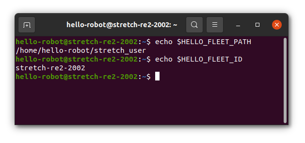

Bash environment variables can be configured to persist between terminal sessions by defining them in a hidden configuration file located at `~/.bashrc`. Try opening this file with `gedit ~/.bashrc` and scrolling to the bottom to see Stretch's BashRC setup.

### File Descriptors

TODO - [Link to file descriptors video here](https://youtu.be/Fqu2P2M092Y)

### Piping

TODO - [Link to piping video here](https://youtu.be/Fqu2P2M092Y)
