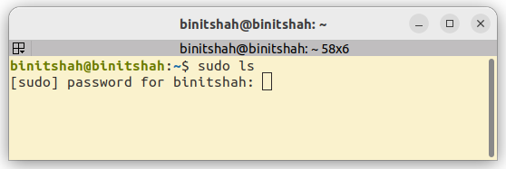

# Launching Apps on Boot

When you deploy Stretch with your application running on it, you might want your application to start automatically when the robot boots up. Linux provides a couple ways of doing this, but the documentation online can be difficult to comb through. This tutorial provides one way to get apps to launch reliably on boot. In particular, this tutorial looks at **Systemd unit files**.

This tutorial assumes a basic understanding of [the Linux terminal](https://docs.hello-robot.com/0.3/developing/basics/#terminal).

## Systemd Unit Files

Systemd manages the OS's services and boot initialization sequence. It provides a CLI called `systemctl` for start/stopping services, configuring whether the service is "enabled" (will launch on next boot) or "disabled", and checking the status of services. Many Linux apps rely on systemd to keep things running in the background (e.g. did you know that SSH-ing into a computer works because that computer is running a SSH daemon via systemd. Try running `systemctl status sshd`). You can describe a service by writing a "systemd unit file". For example, here's the unit file for Stretch Web Teleop:

Filename: web-teleop.service
```
[Unit]
Description=Web interface for Stretch robots.
Wants=network-online.target
After=network-online.target

[Service]
ExecStartPre=/bin/sh -c 'until ping -c1 web.hello-robot.com; do sleep 1; done;'
ExecStart=/home/hello-robot/ament_ws/src/stretch_web_teleop/launch_interface.sh -f
RemainAfterExit=yes

[Install]
WantedBy=graphical-session.target
```

Notice the 3 sections: Unit, Service, and Install.

"Unit" describes the service and declares what the service needs. For web teleop, we need the robot to be connected to the network before launching our application, so we say `Wants=network-online.target` and `After=network-online.target`. There are many targets available. For example, you could target `graphical-session.target` if your application needs a screen to render to. Also notice `ExecStartPre=/bin/sh -c 'until ping -c1 web.hello-robot.com; do sleep 1; done;'` in the next section, which is a reliable way of ensuring the robot is connected to the network **and** able to connect to web.hello-robot.com before launching the service.

"Service" describes what the service should run. `ExecStart=/home/hello-robot/ament_ws/src/stretch_web_teleop/launch_interface.sh -f` is telling systemd that I want it to run the `launch_interface.sh` bash script in my ROS2 workspace. I use the absolute path including `/home/hello-robot` because there is only one user on my robot called "hello-robot" and my unit file is specific to the "hello-robot" user. Here's what launch_interface.sh looks like:

```bash
#!/bin/bash
set -e

REDIRECT_LOGDIR="$HOME/stretch_user/log/web_teleop"
mkdir -p $REDIRECT_LOGDIR
REDIRECT_LOGFILE="$REDIRECT_LOGDIR/start_ros2.`date '+%Y%m%d%H%M'`_redirected.txt"

echo "Setup environment..."
. /etc/hello-robot/hello-robot.conf
export HELLO_FLEET_ID HELLO_FLEET_ID
export HELLO_FLEET_PATH=$HOME/stretch_user
source /opt/ros/humble/setup.bash &>> $REDIRECT_LOGFILE
source ~/ament_ws/install/setup.bash &>> $REDIRECT_LOGFILE
source /usr/share/colcon_cd/function/colcon_cd.sh &>> $REDIRECT_LOGFILE

echo "Freeing robot process..."
/usr/bin/python3 $HOME/.local/bin/stretch_free_robot_process.py &>> $REDIRECT_LOGFILE

echo "Stopping previous instances..."
./stop_interface.sh &>> $REDIRECT_LOGFILE

echo "Reload USB bus..."
sudo udevadm control --reload-rules && sudo udevadm trigger &>> $REDIRECT_LOGFILE

echo "Start ROS2..."
sleep 2;
screen -dm -S "web_teleop_ros" ros2 launch stretch_web_teleop web_interface.launch.py $MAP_ARG $TTS_ARG &>> $REDIRECT_LOGFILE
sleep 3;
```

Notice that almost every command has `&>> $REDIRECT_LOGFILE` after it. The reason behind this is to make it easier for ourselves to debug issues later. Since services start on boot, there's no way for us to see any warning/error messages they emit (technically, there's a tool called journalctl, but in practice, it's difficult to explain to your end-user that they need to learn journalctl to collect logs for you. It's easier to request they zip up a few files and send it your way). Since the output is logged to a timestamped file in `~/stretch_user/log`, it's possible to check it for errors later if issues come up.

This bash script performs four steps before starting the application:

 - Setting up the environment. It's important that env vars like HELLO_FLEET_ID are set and that ROS2 is enabled if your application is based on ROS2
 - Freeing the robot process. Systemd can automatically restart services if they experience an error, so it's nice for this script to ensure the robot is freed up before continuing.
 - Stopping previous instances of web teleop.
 - Reloading the USB bus. `network-online.target` comes after the USB bus is configured in the boot sequence, but it doesn't hurt to ensure USB is ready.

Lastly, the script launches our Web Teleop ROS2 application inside of GNU `screen`. We use `screen` because it collects ROS2 logs in a nicer way than other tools. However, because `screen` launches another process to run the app, we need to inform systemd that the application is still running in the background. Hence, we include `RemainAfterExit=yes` in the unit file

In the last section, "Install", we set `WantedBy=graphical-session.target`. It's important that our service is wanted by some other service, otherwise our service would never be executed by systemd. By telling systemd that our service is wanted by `graphical-session.target`, which is part of the boot sequence, our service also becomes part of the boot sequence.

### Sudo

Your application might require sudo. The Web Teleop application requires it to reload the USB bus (`sudo udevadm control --reload-rules && sudo udevadm trigger`). This can be a problem because using sudo requires users to enter their passwords in an interactive prompt, which is impossible when the service is running in the background while the robot boots.



The solution is to enable the user to run some sudo commands without needing a password. There is a directory called `/etc/sudoers.d/` where you can put rules for commands that are granted this privledge. E.g. when installing Web Teleop, we put the following file in the directory:

Filename: hello_sudoers
```
Cmnd_Alias ONBOOT_WEBTELEOP_SERVICES = /sbin/shutdown, /usr/bin/udevadm, /usr/bin/pkill, /usr/local/sbin/wifi-connect

ALL ALL=(ALL) NOPASSWD:ONBOOT_WEBTELEOP_SERVICES
```

This allows ALL users to run `shutdown`, `udevadm`, `pkill`, and `wifi-connect` with sudo without the password prompt appearing. In effect, this enables your systemd service to succeed in starting your service.

### Where to put unit files

The unit file described above is a "user unit file", as opposed to a "system unit file". User unit files run when the user logins. By default, the "hello-robot" user is configured to login automatically on boot. Furthermore, since the Web Teleop unit file needs a ROS2 workspace in the "hello-robot" user, it makes sense to use a user unit file.

User unit files live in the `~/.config/systemd/user` directory. So when installing the Web Teleop application to launch on boot, we run:

```
cp ./web-teleop.service ~/.config/systemd/user/web-teleop.service
```

Next, we "enable" the service using:

```
systemctl enable --user web-teleop
```

Now, we can reboot the robot and the application should start on boot! 🎉

## Examples

The following pull requests show examples of Stretch applications being configured by Stretch's install scripts to launch on boot.

 - https://github.com/hello-robot/stretch_install/pull/83
 - https://github.com/hello-robot/stretch_install/pull/61/files
