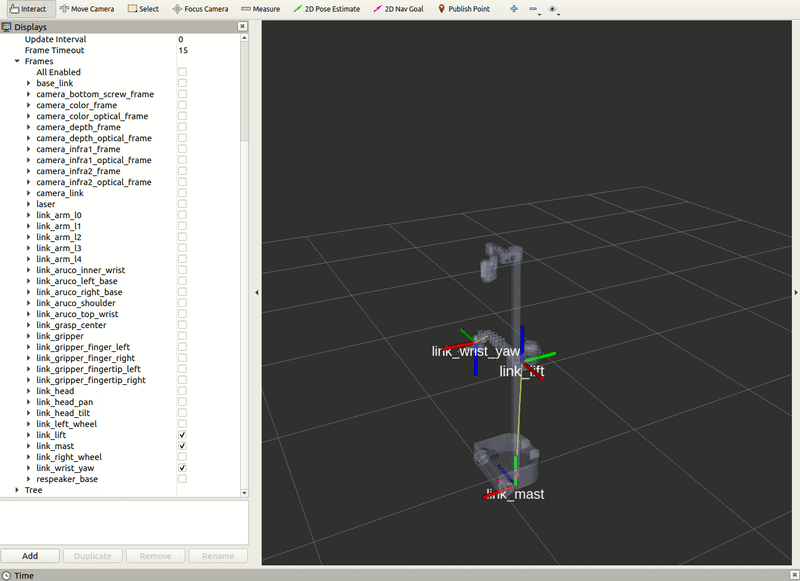
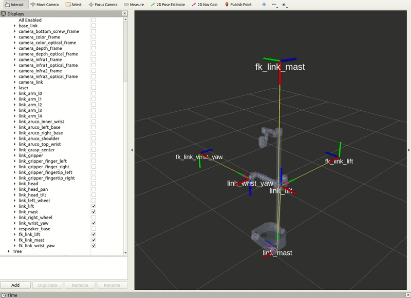
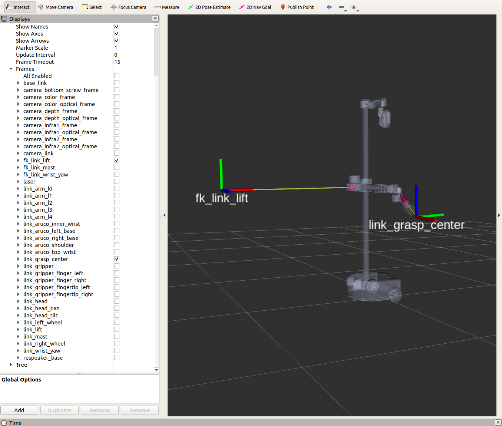

# Example 10

This tutorial provides you an idea of what tf2 can do in the Python track. We will elaborate how to create a tf2 static broadcaster and listener.

## tf2 Static Broadcaster

For the tf2 static broadcaster node, we will be publishing three child static frames in reference to the *link_mast*, *link_lift*, and *link_wrist_yaw* frames.

Begin by starting up the stretch driver launch file.

```bash
# Terminal 1
roslaunch stretch_core stretch_driver.launch
```
Within this tutorial package, there is an RViz config file with the topics for transform frames in the Display tree. You can visualize these topics and the robot model by running the command below in a new terminal.

```bash
# Terminal 2
rosrun rviz rviz -d /home/hello-robot/catkin_ws/src/stretch_tutorials/rviz/tf2_broadcaster_example.rviz
```
Then run the [tf2_broadcaster.py](https://github.com/hello-robot/stretch_tutorials/blob/noetic/src/tf2_broadcaster.py) node to visualize three static frames.

```bash
# Terminal 3
cd catkin_ws/src/stretch_tutorials/src/
python3 tf2_broadcaster.py
```

The gif below visualizes what happens when running the previous node.
<p align="center">
  
</p>

**OPTIONAL**: If you would like to see how the static frames update while the robot is in motion, run the [stow_command_node.py](https://github.com/hello-robot/stretch_tutorials/blob/noetic/src/stow_command.py) and observe the tf frames in RViz.

```bash
# Terminal 4
cd catkin_ws/src/stretch_tutorials/src/
python3 stow_command.py
```

<p align="center">
  
</p>


### The Code

```python
#!/usr/bin/env python3

import rospy
import tf.transformations
from geometry_msgs.msg import TransformStamped
from tf2_ros import StaticTransformBroadcaster

class FixedFrameBroadcaster():
    """
    This node publishes three child static frames in reference to their parent frames as below:
    parent -> link_mast            child -> fk_link_mast
    parent -> link_lift            child -> fk_link_lift
    parent -> link_wrist_yaw       child -> fk_link_wrist_yaw
    """
    def __init__(self):
        """
        A function that creates a broadcast node and publishes three new transform
        frames.
        :param self: The self reference.
        """
        self.br = StaticTransformBroadcaster()

        self.mast = TransformStamped()
        self.mast.header.stamp = rospy.Time.now()
        self.mast.header.frame_id = 'link_mast'
        self.mast.child_frame_id = 'fk_link_mast'
        self.mast.transform.translation.x = 0.0
        self.mast.transform.translation.y = 2.0
        self.mast.transform.translation.z = 0.0
        q = tf.transformations.quaternion_from_euler(1.5707, 0, -1.5707)
        self.mast.transform.rotation.x = q[0]
        self.mast.transform.rotation.y = q[1]
        self.mast.transform.rotation.z = q[2]
        self.mast.transform.rotation.w = q[3]

        self.lift = TransformStamped()
        self.lift.header.stamp = rospy.Time.now()
        self.lift.header.frame_id = 'link_lift'
        self.lift.child_frame_id = 'fk_link_lift'
        self.lift.transform.translation.x = 0.0
        self.lift.transform.translation.y = 1.0
        self.lift.transform.translation.z = 0.0
        q = tf.transformations.quaternion_from_euler(1.5707, 0, -1.5707)
        self.lift.transform.rotation.x = q[0]
        self.lift.transform.rotation.y = q[1]
        self.lift.transform.rotation.z = q[2]
        self.lift.transform.rotation.w = q[3]

        self.wrist = TransformStamped()
        self.wrist.header.stamp = rospy.Time.now()
        self.wrist.header.frame_id = 'link_wrist_yaw'
        self.wrist.child_frame_id = 'fk_link_wrist_yaw'
        self.wrist.transform.translation.x = 0.0
        self.wrist.transform.translation.y = 1.0
        self.wrist.transform.translation.z = 0.0
        q = tf.transformations.quaternion_from_euler(1.5707, 0, -1.5707)
        self.wrist.transform.rotation.x = q[0]
        self.wrist.transform.rotation.y = q[1]
        self.wrist.transform.rotation.z = q[2]
        self.wrist.transform.rotation.w = q[3]

        self.br.sendTransform([self.mast, self.lift, self.wrist])

        rospy.loginfo('Publishing TF frames. Use RViz to visualize')

if __name__ == '__main__':
    rospy.init_node('tf2_broadcaster')
    FixedFrameBroadcaster()
    rospy.spin()
```

### The Code Explained
Now let's break the code down.

```python
#!/usr/bin/env python3
```
Every Python ROS [Node](http://wiki.ros.org/Nodes) will have this declaration at the top. The first line makes sure your script is executed as a Python3 script.

```python
import rospy
import tf.transformations
from geometry_msgs.msg import TransformStamped
from tf2_ros import StaticTransformBroadcaster
```
You need to import rospy if you are writing a ROS [Node](http://wiki.ros.org/Nodes). Import `tf.transformations` to get quaternion values from Euler angles. Import the `TransformStamped` from the `geometry_msgs.msg` package because we will be publishing static frames and it requires this message type. The `tf2_ros` package provides an implementation of a `tf2_ros.StaticTransformBroadcaster` to help make the task of publishing transforms easier.

```python
def __init__(self):
    """
    A function that creates a broadcast node and publishes three new transform
    frames.
    :param self: The self reference.
    """
    self.br = StaticTransformBroadcaster()
```
Here we create a `TransformStamped` object which will be the message we will send over once populated.

```python
self.mast = TransformStamped()
self.mast.header.stamp = rospy.Time.now()
self.mast.header.frame_id = 'link_mast'
self.mast.child_frame_id = 'fk_link_mast'
```
We need to give the transform being published a timestamp, we'll just stamp it with the current time, `rospy.Time.now()`. Then, we need to set the name of the parent frame of the link we're creating, in this case *link_mast*. Finally, we need to set the name of the child frame of the link we're creating. In this instance, the child frame is *fk_link_mast*.

```python
self.mast.transform.translation.x = 0.0
self.mast.transform.translation.y = 2.0
self.mast.transform.translation.z = 0.0
```
Set the translation values for the child frame.

```python
q = tf.transformations.quaternion_from_euler(1.5707, 0, -1.5707)
self.wrist.transform.rotation.x = q[0]
self.wrist.transform.rotation.y = q[1]
self.wrist.transform.rotation.z = q[2]
self.wrist.transform.rotation.w = q[3]
```
The `quaternion_from_euler()` function takes in a Euler angle argument and returns a quaternion values. Then set the rotation values to the transformed quaternions.

This process will be completed for the *link_lift* and *link_wrist_yaw* as well.

```python
self.br.sendTransform([self.mast, self.lift, self.wrist])
```
Send the three transforms using the `sendTransform()` function.

```python
rospy.init_node('tf2_broadcaster')
FixedFrameBroadcaster()

```
The next line, `rospy.init_node(NAME, ...)`, is very important as it tells rospy the name of your node -- until rospy has this information, it cannot start communicating with the ROS Master. **NOTE:** the name must be a base name, i.e. it cannot contain any slashes "/".

Instantiate the `FixedFrameBroadcaster()` class.

```python
rospy.spin()
```
Give control to ROS.  This will allow the callback to be called whenever new
messages come in.  If we don't put this line in, then the node will not work,
and ROS will not process any messages.


## tf2 Static Listener
In the previous section of the tutorial, we created a tf2 broadcaster to publish three static transform frames. In this section we will create a tf2 listener that will find the transform between *fk_link_lift* and *link_grasp_center*.

Begin by starting up the stretch driver launch file.

```bash
# Terminal 1
roslaunch stretch_core stretch_driver.launch
```
Then run the [tf2_broadcaster.py](https://github.com/hello-robot/stretch_tutorials/blob/noetic/src/tf2_broadcaster.py) node to create the three static frames.

```bash
# Terminal 2
cd catkin_ws/src/stretch_tutorials/src/
python3 tf2_broadcaster.py
```
Finally, run the [tf2_listener.py](https://github.com/hello-robot/stretch_tutorials/blob/noetic/src/tf2_listener.py) node to print the transform between two links.

```bash
# Terminal 3
cd catkin_ws/src/stretch_tutorials/src/
python3 tf2_listener.py
```
Within the terminal the transform will be printed every 1 second. Below is an example of what will be printed in the terminal. There is also an image for reference of the two frames.

```bash
[INFO] [1659551318.098168]: The pose of target frame link_grasp_center with reference from fk_link_lift is:
translation:
  x: 1.08415191335
  y: -0.176147838153
  z: 0.576720021135
rotation:
  x: -0.479004489528
  y: -0.508053545368
  z: -0.502884087254
  w: 0.509454501243
```

<p align="center">
  
</p>


### The Code

```python
#!/usr/bin/env python3

import rospy
from geometry_msgs.msg import TransformStamped
import tf2_ros

class FrameListener():
    """
    This Class prints the transformation between the fk_link_mast frame and the
    target frame, link_grasp_center.
    """
    def __init__(self):
        """
        A function that initializes the variables and looks up a transformation
        between a target and source frame.
        :param self: The self reference.
        """
        tf_buffer = tf2_ros.Buffer()
        listener = tf2_ros.TransformListener(tf_buffer)

        from_frame_rel = 'link_grasp_center'
        to_frame_rel = 'fk_link_lift'

        rospy.sleep(1.0)
        rate = rospy.Rate(1)

        while not rospy.is_shutdown():
            try:
                trans = tf_buffer.lookup_transform(to_frame_rel,
                                                   from_frame_rel,
                                                   rospy.Time())
                rospy.loginfo('The pose of target frame %s with reference from %s is: \n %s', from_frame_rel, to_frame_rel, trans.transform)
            except (tf2_ros.LookupException, tf2_ros.ConnectivityException, tf2_ros.ExtrapolationException):
                rospy.logwarn(' Could not transform %s from %s ', to_frame_rel, from_frame_rel)

            rate.sleep()

if __name__ == '__main__':
    rospy.init_node('tf2_listener')
    FrameListener()
    rospy.spin()
```


### The Code Explained
Now let's break the code down.

```python
#!/usr/bin/env python3
```
Every Python ROS [Node](http://wiki.ros.org/Nodes) will have this declaration at the top. The first line makes sure your script is executed as a Python3 script.

```python
import rospy
from geometry_msgs.msg import TransformStamped
import tf2_ros
```

You need to import rospy if you are writing a ROS [Node](http://wiki.ros.org/Nodes). Import the `TransformStamped` from the `geometry_msgs.msg` package because we will be publishing static frames and it requires this message type. The `tf2_ros` package provides an implementation of a `tf2_ros.TransformListener` to help make the task of receiving transforms easier.

```python
tf_buffer = tf2_ros.Buffer()
listener = tf2_ros.TransformListener(tf_buffer)
```
Here, we create a `TransformListener` object. Once the listener is created, it starts receiving tf2 transformations over the wire, and buffers them for up to 10 seconds.

```python
from_frame_rel = 'link_grasp_center'
to_frame_rel = 'fk_link_lift'
```
Store frame names in variables that will be used to compute transformations.

```python
rospy.sleep(1.0)
rate = rospy.Rate(1)
```
The first line gives the listener some time to accumulate transforms. The second line is the rate the node is going to publish information (1 Hz).

```python
try:
    trans = tf_buffer.lookup_transform(to_frame_rel,
                                       from_frame_rel,
                                       rospy.Time())
    rospy.loginfo('The pose of target frame %s with reference from %s is: \n %s', from_frame_rel, to_frame_rel, trans.transform)

except (tf2_ros.LookupException, tf2_ros.ConnectivityException, tf2_ros.ExtrapolationException):
    rospy.logwarn(' Could not transform %s from %s ', to_frame_rel, from_frame_rel)
```
Try to look up the transform we want. Use a try-except block, since it may fail on any single call, due to internal timing issues in the transform publishers. Look up transform between *from_frame_rel* and *to_frame_rel* frames with the `lookup_transform()` function.

```python
rospy.init_node('tf2_listener')
FrameListener()

```
The next line, `rospy.init_node(NAME, ...)`, is very important as it tells rospy the name of your node -- until rospy has this information, it cannot start communicating with the ROS Master. **NOTE:** the name must be a base name, i.e. it cannot contain any slashes "/".

Instantiate the `FrameListener()` class.

```python
rospy.spin()
```
Give control to ROS.  This will allow the callback to be called whenever new messages come in.  If we don't put this line in, then the node will not work, and ROS will not process any messages.


**Previous Example** [Voice Teleoperation of Base](example_9.md)
**Next Example** [PointCloud Transformation](example_11.md)
