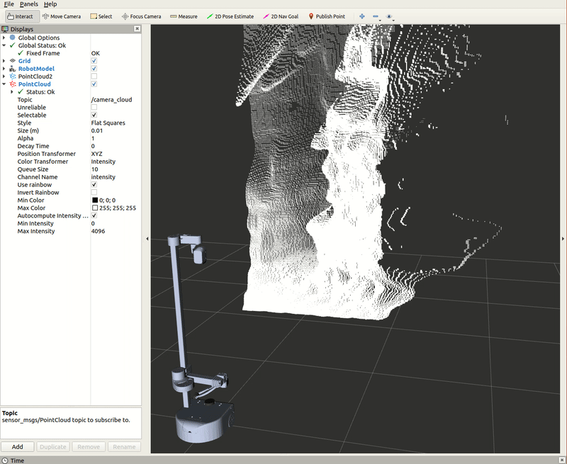

## Example 11

This tutorial highlights how to create a [PointCloud](http://docs.ros.org/en/melodic/api/sensor_msgs/html/msg/PointCloud.html) message from the data of a [PointCloud2](http://docs.ros.org/en/noetic/api/sensor_msgs/html/msg/PointCloud2.html) message type, then transform the PointCloud's reference link to a different frame. The data published by the RealSense is referencing its *camera_color_optical_frame* link, and we will be changing its reference to the *base_link*.

Begin by starting up the stretch driver launch file.

```bash
# Terminal 1
roslaunch stretch_core stretch_driver.launch
```

To activate the RealSense camera and publish topics to be visualized, run the following launch file in a new terminal.


```bash
# Terminal 2
roslaunch stretch_core d435i_low_resolution.launch
```

Then run the `PointCloud` transformer node.

```bash
# Terminal 3
cd catkin_ws/src/stretch_tutorials/src/
python3 pointcloud_transformer.py
```

Within this tutorial package, there is an RViz config file with the `PointCloud` in the Display tree. You can visualize this topic and the robot model by running the command below in a new terminal.

```bash
# Terminal 4
rosrun rviz rviz -d /home/hello-robot/catkin_ws/src/stretch_tutorials/rviz/PointCloud_transformer_example.rviz
```

The gif below visualizes what happens when running the previous node.

<p align="center">
  
</p>


### The Code

```python
#!/usr/bin/env python3
import rospy
import tf
import sensor_msgs.point_cloud2 as pc2
from sensor_msgs.msg import PointCloud2, PointCloud
from geometry_msgs.msg import Point32
from std_msgs.msg import Header

class PointCloudTransformer:
    """
    A class that takes in a PointCloud2 message and stores its points into a
    PointCloud message. Then that PointCloud is transformed to reference the
    'base_link' frame.
    """
    def __init__(self):
        """
        Function that initializes the subscriber, publisher, and other variables.
        :param self: The self reference.
        """
        self.pointcloud2_sub = rospy.Subscriber("/camera/depth/color/points", PointCloud2, self.callback_pcl2, queue_size=1)
        self.pointcloud_pub = rospy.Publisher("/camera_cloud", PointCloud, queue_size=1)
        self.pcl2_cloud = None
        self.listener = tf.TransformROS(True, rospy.Duration(10.0))
        rospy.loginfo('Publishing transformed PointCloud. Use RViz to visualize')

    def callback_pcl2(self,msg):
        """
        Callback function that stores the PointCloud2 message.
        :param self: The self reference.
        :param msg: The PointCloud2 message type.
        """
        self.pcl2_cloud = msg

    def pcl_transformer(self):
        """
        A function that extracts the points from the stored PointCloud2 message
        and appends those points to a PointCloud message. Then the function transforms
        the PointCloud from its the header frame id, 'camera_color_optical_frame'
        to the 'base_link' frame.
        :param self: The self reference.
        """
        temp_cloud = PointCloud()
        temp_cloud.header = self.pcl2_cloud.header
        for data in pc2.read_points(self.pcl2_cloud, skip_nans=True):
            temp_cloud.points.append(Point32(data[0],data[1],data[2]))

        transformed_cloud = self.transform_pointcloud(temp_cloud)
        self.pointcloud_pub.publish(transformed_cloud)

    def transform_pointcloud(self,msg):
        """
        Function that stores the PointCloud2 message.
        :param self: The self reference.
        :param msg: The PointCloud message.

        :returns new_cloud: PointCloud message.
        """
        while not rospy.is_shutdown():
            try:
                new_cloud = self.listener.transformPointCloud("/base_link" ,msg)
                return new_cloud
                if new_cloud:
                    break
            except (tf.LookupException, tf.ConnectivityException,tf.ExtrapolationException):
                pass

if __name__=="__main__":
    rospy.init_node('pointcloud_transformer',anonymous=True)
    PCT = PointCloudTransformer()
    rate = rospy.Rate(1)
    rospy.sleep(1)

    while not rospy.is_shutdown():
        PCT.pcl_transformer()
        rate.sleep()
```

### The Code Explained
Now let's break the code down.

```python
#!/usr/bin/env python3
```
Every Python ROS [Node](http://wiki.ros.org/Nodes) will have this declaration at the top. The first line makes sure your script is executed as a Python3 script.

```python
import rospy
import tf
import sensor_msgs.point_cloud2 as pc2
from sensor_msgs.msg import PointCloud2, PointCloud
from geometry_msgs.msg import Point32
from std_msgs.msg import Header
```

You need to import `rospy` if you are writing a ROS Node. Import `tf` to utilize the `transformPointCloud` function. Import various the message types from `sensor_msgs`.

```python
self.pointcloud2_sub = rospy.Subscriber("/camera/depth/color/points", PointCloud2, self.callback_pcl2, queue_size=1)
```
Set up a subscriber.  We're going to subscribe to the topic */camera/depth/color/points*, looking for `PointCloud2` message.  When a message comes in, ROS is going to pass it to the function `callback_pcl2()` automatically.

```python
self.pointcloud_pub = rospy.Publisher("/camera_cloud", PointCloud, queue_size=1)
```

This section of code defines the talker's interface to the rest of ROS. `self.pointcloud_pub = rospy.Publisher("/camera_cloud", PointCloud, queue_size=1)` declares that your node is publishing to the */camera_cloud* topic using the message type `PointCloud`.

```python
self.pcl2_cloud = None
self.listener = tf.TransformListener(True, rospy.Duration(10.0))
```

The first line of code initializes *self.pcl2_cloud* to store the `PointCloud2` message. The second line creates a `tf.TransformListener` object. Once the listener is created, it starts receiving tf transformations over the wire, and buffers them for up to 10 seconds.

```python
def callback_pcl2(self,msg):
    """
    Callback function that stores the PointCloud2 message.
    :param self: The self reference.
    :param msg: The PointCloud2 message type.
    """
    self.pcl2_cloud = msg
```
The callback function that stores the the `PointCloud2` message.

```python
temp_cloud = PointCloud()
temp_cloud.header = self.pcl2_cloud.header
```

Create a `PointCloud` for temporary use. Set the temporary PointCloud's header to the stored PointCloud2 header.

```python
for data in pc2.read_points(self.pcl2_cloud, skip_nans=True):
  temp_cloud.points.append(Point32(data[0],data[1],data[2]))
```

Use a for loop to extract `PointCloud2` data into a list of x, y, z points and append those values to the `PointCloud` message, *temp_cloud*.

```python
transformed_cloud = self.transform_pointcloud(temp_cloud)
```

Utilize the `transform_pointcloud` function to transform the points in the `PointCloud` message to reference the *base_link*

```python
while not rospy.is_shutdown():
        try:
            new_cloud = self.listener.transformPointCloud("/base_link" ,msg)
            return new_cloud
            if new_cloud:
                break
        except (tf.LookupException, tf.ConnectivityException,tf.ExtrapolationException):
            pass
```

Try to look up and transform the `PointCloud` input. Use a try-except block, since it may fail on any single call, due to internal timing issues in the transform publishers. Transform the point cloud data from *camera_color_optical_frame* to *base_link* with the `transformPointCloud()` function.


```python
self.pointcloud_pub.publish(transformed_cloud)
```

Publish the new transformed `PointCloud`.

```python
rospy.init_node('pointcloud_transformer',anonymous=True)
PCT = PointCloudTransformer()

```
The next line, `rospy.init_node(NAME, ...)`, is very important as it tells rospy the name of your node -- until rospy has this information, it cannot start communicating with the ROS Master. In this case, your node will take on the name talker. NOTE: the name must be a base name, i.e. it cannot contain any slashes "/".

Declare object, *PCT*, from the `PointCloudTransformer` class.

```python
rate = rospy.Rate(1)
rospy.sleep(1)
```

The first line gives the listener some time to accumulate transforms. The second line is the rate the node is going to publish information (1 Hz).

```python
# Run while loop until the node is shutdown
  while not rospy.is_shutdown():

      # Run the pcl_transformer method
      PCT.pcl_transformer()
      rate.sleep()
```
Run a while loop until the node is shutdown. Within the while loop run the `pcl_transformer()` method.


**Previous Example** [Tf2 Broadcaster and Listener](example_10.md)
