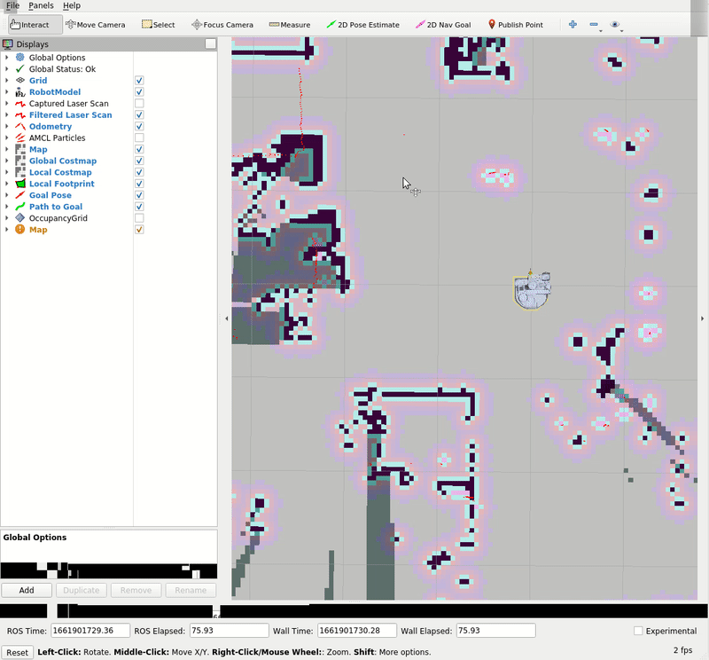

# Example 13

In this example, we will be utilizing the [move_base ROS node](http://wiki.ros.org/move_base), a component of the [ROS navigation stack](http://wiki.ros.org/navigation?distro=melodic) to send base goals to the Stretch robot.

## Build a map

First, begin by building a map of the space the robot will be navigating in. If you need a refresher on how to do this, then check out the [Navigation Stack tutorial](navigation_stack.md).

## Getting Started

Next, with your created map, we can navigate the robot around the mapped space. Run:

```bash
roslaunch stretch_navigation navigation.launch map_yaml:=${HELLO_FLEET_PATH}/maps/<map_name>.yaml
```
Where `${HELLO_FLEET_PATH}` is the path of the `<map_name>.yaml` file.

**IMPORTANT NOTE:** It's likely that the robot's location in the map does not match the robot's location in the real space. In the top bar of Rviz, use 2D Pose Estimate to lay an arrow down roughly where the robot is located in the real space. Below is a gif for reference.

<p align="center">
  
</p>

Now we are going to use a node to send a a move base goal half a meter in front of the map's origin. run the following command to run the [navigation.py](https://github.com/hello-robot/stretch_tutorials/blob/main/src/navigation.py) node.

### The Code

```python
#!/usr/bin/env python

import rospy
import actionlib
import sys
from move_base_msgs.msg import MoveBaseAction, MoveBaseGoal
from geometry_msgs.msg import Quaternion
from tf import transformations

class StretchNavigation:
    """
    A simple encapsulation of the navigation stack for a Stretch robot.
    """
    def __init__(self):
        """
        Create an instance of the simple navigation interface.
        :param self: The self reference.
        """
        self.client = actionlib.SimpleActionClient('move_base', MoveBaseAction)
        self.client.wait_for_server()
        rospy.loginfo('{0}: Made contact with move_base server'.format(self.__class__.__name__))

        self.goal = MoveBaseGoal()
        self.goal.target_pose.header.frame_id = 'map'
        self.goal.target_pose.header.stamp = rospy.Time()

        self.goal.target_pose.pose.position.x = 0.0
        self.goal.target_pose.pose.position.y = 0.0
        self.goal.target_pose.pose.position.z = 0.0
        self.goal.target_pose.pose.orientation.x = 0.0
        self.goal.target_pose.pose.orientation.y = 0.0
        self.goal.target_pose.pose.orientation.z = 0.0
        self.goal.target_pose.pose.orientation.w = 1.0

    def get_quaternion(self,theta):
        """
        A function to build Quaternians from Euler angles. Since the Stretch only
        rotates around z, we can zero out the other angles.
        :param theta: The angle (radians) the robot makes with the x-axis.
        """
        return Quaternion(*transformations.quaternion_from_euler(0.0, 0.0, theta))

    def go_to(self, x, y, theta):
        """
        Drive the robot to a particlar pose on the map. The Stretch only needs
        (x, y) coordinates and a heading.
        :param x: x coordinate in the map frame.
        :param y: y coordinate in the map frame.
        :param theta: heading (angle with the x-axis in the map frame)
        """
        rospy.loginfo('{0}: Heading for ({1}, {2}) at {3} radians'.format(self.__class__.__name__,
        x, y, theta))

        self.goal.target_pose.pose.position.x = x
        self.goal.target_pose.pose.position.y = y
        self.goal.target_pose.pose.orientation = self.get_quaternion(theta)

        self.client.send_goal(self.goal, done_cb=self.done_callback)
        self.client.wait_for_result()

    def done_callback(self, status, result):
        """
        The done_callback function will be called when the joint action is complete.
        :param self: The self reference.
        :param status: status attribute from MoveBaseActionResult message.
        :param result: result attribute from MoveBaseActionResult message.
        """
        if status == actionlib.GoalStatus.SUCCEEDED:
            rospy.loginfo('{0}: SUCCEEDED in reaching the goal.'.format(self.__class__.__name__))
        else:
            rospy.loginfo('{0}: FAILED in reaching the goal.'.format(self.__class__.__name__))

if __name__ == '__main__':
    rospy.init_node('navigation', argv=sys.argv)
    nav = StretchNavigation()
    nav.go_to(0.5, 0.0, 0.0, wait=True)
```

### The Code Explained
Now let's break the code down.

```python
#!/usr/bin/env python
```
Every Python ROS [Node](http://wiki.ros.org/Nodes) will have this declaration at the top. The first line makes sure your script is executed as a Python script.

```python
import rospy
import actionlib
import sys
from move_base_msgs.msg import MoveBaseAction, MoveBaseGoal
from geometry_msgs.msg import Quaternion
from tf import transformations
```
You need to import `rospy` if you are writing a ROS [Node](http://wiki.ros.org/Nodes).

```python
self.client = actionlib.SimpleActionClient('move_base', MoveBaseAction)
self.client.wait_for_server()
rospy.loginfo('{0}: Made contact with move_base server'.format(self.__class__.__name__))
```
Set up a client for the navigation action. On the Stretch, this is called `move_base`, and has type `MoveBaseAction`.  Once we make the client, we wait for the server to be ready.

```python
self.goal = MoveBaseGoal()
self.goal.target_pose.header.frame_id = 'map'
self.goal.target_pose.header.stamp = rospy.Time()
```
Make a goal for the action. Specify the coordinate frame that we want, in this instance the *map*. Then we set the time to be now.

```python  
self.goal.target_pose.pose.position.x = 0.0
self.goal.target_pose.pose.position.y = 0.0
self.goal.target_pose.pose.position.z = 0.0
self.goal.target_pose.pose.orientation.x = 0.0
self.goal.target_pose.pose.orientation.y = 0.0
self.goal.target_pose.pose.orientation.z = 0.0
self.goal.target_pose.pose.orientation.w = 1.0
```
Initialize a position in the coordinate frame.

```python
def get_quaternion(self,theta):
    """
    A function to build Quaternians from Euler angles. Since the Stretch only
    rotates around z, we can zero out the other angles.
    :param theta: The angle (radians) the robot makes with the x-axis.
    """
    return Quaternion(*transformations.quaternion_from_euler(0.0, 0.0, theta))
```
A function that transforms Euler angles to quaternions and returns those values.

```python
def go_to(self, x, y, theta, wait=False):
    """
    Drive the robot to a particular pose on the map. The Stretch only needs
    (x, y) coordinates and a heading.
    :param x: x coordinate in the map frame.
    :param y: y coordinate in the map frame.
    :param theta: heading (angle with the x-axis in the map frame)
    """
    rospy.loginfo('{0}: Heading for ({1}, {2}) at {3} radians'.format(self.__class__.__name__,
    x, y, theta))
```
The `go_to()` function takes in the 3 arguments, the x and y coordinates in the *map* frame, and the heading.

```python
self.goal.target_pose.pose.position.x = x
self.goal.target_pose.pose.position.y = y
self.goal.target_pose.pose.orientation = self.get_quaternion(theta)
```
The `MoveBaseGoal()` data structure has three goal positions (in meters), along each of the axes. For Stretch, it will only pay attention to the x and y coordinates, since it can't move in the z direction.

```python
self.client.send_goal(self.goal, done_cb=self.done_callback)
self.client.wait_for_result()
```
Send the goal and include the `done_callback()` function in one of the arguments in `send_goal()`.

```python
def done_callback(self, status, result):
    """
    The done_callback function will be called when the joint action is complete.
    :param self: The self reference.
    :param status: status attribute from MoveBaseActionResult message.
    :param result: result attribute from MoveBaseActionResult message.
    """
    if status == actionlib.GoalStatus.SUCCEEDED:
        rospy.loginfo('{0}: SUCCEEDED in reaching the goal.'.format(self.__class__.__name__))
    else:
        rospy.loginfo('{0}: FAILED in reaching the goal.'.format(self.__class__.__name__))
```
Conditional statement to print whether the goal status in the `MoveBaseActionResult` succeeded or failed.

```python
rospy.init_node('navigation', argv=sys.argv)
nav = StretchNavigation()
```
The next line, `rospy.init_node(NAME, ...)`, is very important as it tells rospy the name of your node -- until rospy has this information, it cannot start communicating with the ROS Master. **NOTE:** the name must be a base name, i.e. it cannot contain any slashes "/".

Declare the `StretchNavigation` object.

```python
nav.go_to(0.5, 0.0, 0.0)
```
Send a move base goal half a meter in front of the map's .
