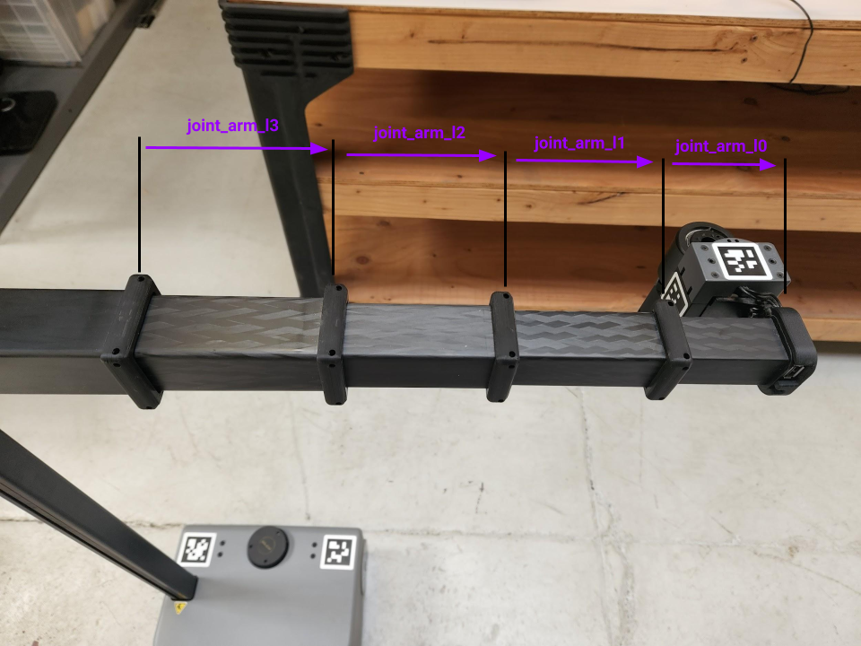

## Example 5

In this example, we will review a Python script that prints out the positions of a selected group of Stretch's joints. This script is helpful if you need the joint positions after you teleoperated Stretch with the Xbox controller or physically moved the robot to the desired configuration after hitting the run stop button.

If you are looking for a continuous print of the joint states while Stretch is in action, then you can use the [rostopic command-line tool](http://wiki.ros.org/rostopic) shown in the [Internal State of Stretch Tutorial](internal_state_of_stretch.md).

Begin by starting up the stretch driver launch file.

```bash
# Terminal 1
roslaunch stretch_core stretch_driver.launch
```

You can then hit the run-stop button (you should hear a beep and the LED light in the button blink) and move the robot's joints to a desired configuration. Once you are satisfied with the configuration, hold the run-stop button until you hear a beep. Then run the following command to print the joint positions of the lift, arm, and wrist.

```bash
cd catkin_ws/src/stretch_tutorials/src/
python joint_state_printer.py
```
Your terminal will output the `position` information of the previously mentioned joints shown below.
```
name: ['joint_lift', 'joint_arm_l0', 'joint_arm_l1', 'joint_arm_l2', 'joint_arm_l3', 'joint_wrist_yaw']
position: [1.004518435897309, 0.12361581673760723, 0.023224914142933994, 0.07758496706423101, 0.12309362763409384, 1.8771004095879587]

```

It's important to note that the arm has 4 prismatic joints and the sum of these positions gives the wrist extension distance. The wrist extension is needed when sending [joint trajectory commands](follow_joint_trajectory.md) to the robot. Here is an image of the arm joints for reference:

<p align="center">
  
</p>

### The Code
```python
#!/usr/bin/env python

import rospy
import sys
from sensor_msgs.msg import JointState

class JointStatePublisher():
	"""
	A class that prints the positions of desired joints in Stretch.
	"""
	def __init__(self):
		"""
		Function that initializes the subsriber.
		:param self: The self reference.
		"""
		self.sub = rospy.Subscriber('joint_states', JointState, self.callback)

	def callback(self, msg):
		"""
		Callback function to deal with the incoming JointState messages.
		:param self: The self reference.
		:param msg: The JointState message.
		"""
		self.joint_states = msg

	def print_states(self, joints):
		"""
		print_states function to deal with the incoming JointState messages.
		:param self: The self reference.
		:param joints: A list of joint names.
		"""
		joint_positions = []
		for joint in joints:
			index = self.joint_states.name.index(joint)
			joint_positions.append(self.joint_states.position[index])
		print("name: " + str(joints))
		print("position: " + str(joint_positions))
		rospy.signal_shutdown("done")
		sys.exit(0)

if __name__ == '__main__':
	rospy.init_node('joint_state_printer', anonymous=True)
	JSP = JointStatePublisher()
	rospy.sleep(.1)
	joints = ["joint_lift", "joint_arm_l0", "joint_arm_l1", "joint_arm_l2", "joint_arm_13", "joint_wrist_yaw"]
	#joints = ["joint_head_pan","joint_head_tilt", joint_gripper_finger_left", "joint_gripper_finger_right"]
	JSP.print_states(joints)
	rospy.spin()
```


### The Code Explained
Now let's break the code down.

```python
#!/usr/bin/env python
```
Every Python ROS [Node](http://wiki.ros.org/Nodes) will have this declaration at the top. The first line makes sure your script is executed as a Python script.


```python
import rospy
import sys
from sensor_msgs.msg import JointState
```
You need to import rospy if you are writing a ROS Node. Import sensor_msgs.msg so that we can subscribe to JointState messages.

```python
self.sub = rospy.Subscriber('joint_states', JointState, self.callback)
```
Set up a subscriber.  We're going to subscribe to the topic "joint_states", looking for JointState messages.  When a message comes in, ROS is going to pass it to the function "callback" automatically

```python
def callback(self, msg):
	self.joint_states = msg
```
This is the callback function where he JointState messages are stored as *self.joint_states*. Further information about the this message type can be found here: [JointState Message](http://docs.ros.org/en/lunar/api/sensor_msgs/html/msg/JointState.html)

```python
def print_states(self, joints):
	joint_positions = []

```
This is the *print_states()* function which takes in a list of joints of interest as its argument. the is also an empty list set as *joint_positions* and this is where the positions of the requested joints will be appended.

```python
for joint in joints:
	index = self.joint_states.name.index(joint)
	joint_positions.append(self.joint_states.position[index])
print(joint_positions)
```
In this section of the code, a forloop is used to parse the names of the requested joints from the *self.joint_states* list. The index() function returns the index a of the name of the requested joint and appends the respective position to our *joint_positions* list.

```python
rospy.signal_shutdown("done")
sys.exit(0)
```
The first line of code initias a clean shutodwn of ROS. The second line of code exits the Python interpreter.

```python
rospy.init_node('joint_state_printer', anonymous=True)
JSP = JointStatePublisher()
rospy.sleep(.1)
```
The next line, rospy.init_node(NAME, ...), is very important as it tells rospy the name of your node -- until rospy has this information, it cannot start communicating with the ROS Master. In this case, your node will take on the name talker. NOTE: the name must be a base name, i.e. it cannot contain any slashes "/".

Declare object, *JSP*, from the `JointStatePublisher` class.

The use of the `rospy.sleep()` function is to allow the *JSP* class to initialize all of its features before requesting to publish joint positions of desired joints (running the `print_states()` function).

```python
joints = ["joint_lift", "joint_arm_l0", "joint_arm_l1", "joint_arm_l2", "joint_arm_13", "joint_wrist_yaw"]
#joints = ["joint_head_pan","joint_head_tilt", joint_gripper_finger_left", "joint_gripper_finger_right"]
JSP.print_states(joints)
```
Create a list of the desired joints that you want positions to be printed. Then use that list as an argument for the `print_states()` function.

```python
rospy.spin()
```
Give control to ROS with `rospy.spin()`. This will allow the callback to be called whenever new messages come in. If we don't put this line in, then the node will not work, and ROS will not process any messages.

**Previous Example** [Example 4](example_4.md)
**Next Example** [Example 6](example_6.md)
