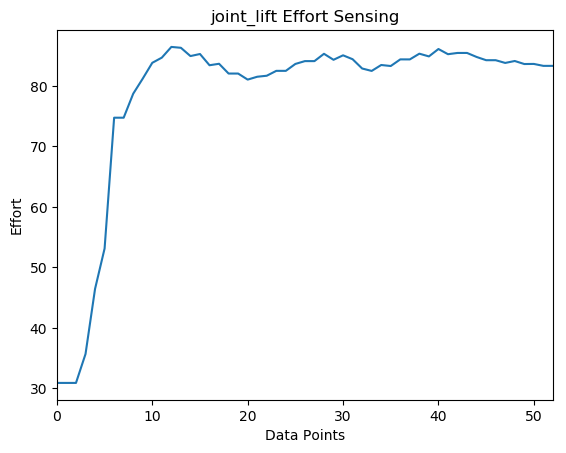

## Example 6

In this example, we will review a Python script that prints out and stores the effort values from a specified joint. If you are looking for a continuous print of the joint state efforts while Stretch is in action, then you can use the [rostopic command-line tool](http://wiki.ros.org/rostopic) shown in the [Internal State of Stretch Tutorial](internal_state_of_stretch.md).

<p align="center">
  
</p>

Begin by running the following command in the terminal in a terminal.

```bash
# Terminal 1
roslaunch stretch_core stretch_driver.launch
```
Switch the mode to *position* mode using a rosservice call. Then run the single effort sensing node.

```bash
# Terminal 2
rosservice call /switch_to_position_mode
cd catkin_ws/src/stretch_tutorials/src/
python effort_sensing.py
```
This will send a `FollowJointTrajectory` command to move Stretch's arm or head while also printing the effort of the lift.

### The Code
```python
#!/usr/bin/env python
import rospy
import time
import actionlib
import os
import csv
from datetime import datetime

from control_msgs.msg import FollowJointTrajectoryGoal
from trajectory_msgs.msg import JointTrajectoryPoint
from sensor_msgs.msg import JointState
import hello_helpers.hello_misc as hm

class JointActuatorEffortSensor(hm.HelloNode):
    """
    A class that sends multiple joint trajectory goals to a single joint.
    """
    def __init__(self, export_data=False):
        """
        Function that initializes the subscriber,and other features.
        :param self: The self reference.
        :param export_data: A boolean message type.
        """
        hm.HelloNode.__init__(self)
        self.sub = rospy.Subscriber('joint_states', JointState, self.callback)
        self.joints = ['joint_lift']
        self.joint_effort = []
        self.save_path = '/home/hello-robot/catkin_ws/src/stretch_tutorials/stored_data'
        self.export_data = export_data

    def callback(self, msg):
        """
        Callback function to update and store JointState messages.
        :param self: The self reference.
        :param msg: The JointState message.
        """
        self.joint_states = msg

    def issue_command(self):
        """
        Function that makes an action call and sends joint trajectory goals
        to a single joint.
        :param self: The self reference.
        """
        trajectory_goal = FollowJointTrajectoryGoal()
        trajectory_goal.trajectory.joint_names = self.joints

        point0 = JointTrajectoryPoint()
        point0.positions = [0.9]

        trajectory_goal.trajectory.points = [point0]
        trajectory_goal.trajectory.header.stamp = rospy.Time(0.0)
        trajectory_goal.trajectory.header.frame_id = 'base_link'
        self.trajectory_client.send_goal(trajectory_goal, feedback_cb=self.feedback_callback, done_cb=self.done_callback)
        rospy.loginfo('Sent stow goal = {0}'.format(trajectory_goal))
        self.trajectory_client.wait_for_result()

    def feedback_callback(self,feedback):
        """
        The feedback_callback function deals with the incoming feedback messages
        from the trajectory_client. Although, in this function, we do not use the
        feedback information.
        :param self: The self reference.
        :param feedback: FollowJointTrajectoryActionFeedback message.
        """
        if 'wrist_extension' in self.joints:
            self.joints.remove('wrist_extension')
            self.joints.append('joint_arm_l0')

        current_effort = []
        for joint in self.joints:
            index = self.joint_states.name.index(joint)
            current_effort.append(self.joint_states.effort[index])

        if not self.export_data:
            print("name: " + str(self.joints))
            print("effort: " + str(current_effort))
        else:
            self.joint_effort.append(current_effort)


    def done_callback(self, status, result):
        """
        The done_callback function will be called when the joint action is complete.
        Within this function we export the data to a .txt file in  the /stored_data directory.
        :param self: The self reference.
        :param status: status attribute from FollowJointTrajectoryActionResult message.
        :param result: result attribute from FollowJointTrajectoryActionResult message.
        """
        if status == actionlib.GoalStatus.SUCCEEDED:
            rospy.loginfo('Succeeded')
        else:
            rospy.loginfo('Failed')

        if self.export_data:
            file_name = datetime.now().strftime("%Y-%m-%d_%I:%M:%S-%p")
            completeName = os.path.join(self.save_path, file_name)
            with open(completeName, "w") as f:
                writer = csv.writer(f)
                writer.writerow(self.joints)
                writer.writerows(self.joint_effort)

    def main(self):
        """
        Function that initiates the issue_command function.
        :param self: The self reference.
        """
        hm.HelloNode.main(self, 'issue_command', 'issue_command', wait_for_first_pointcloud=False)
        rospy.loginfo('issuing command...')
        self.issue_command()
        time.sleep(2)

if __name__ == '__main__':
	try:
		node = JointActuatorEffortSensor(export_data=True)
		node.main()
	except KeyboardInterrupt:
		rospy.loginfo('interrupt received, so shutting down')

```


### The Code Explained
This code is similar to that of the [multipoint_command](https://github.com/hello-robot/stretch_tutorials/blob/main/src/multipoint_command.py) and [joint_state_printer](https://github.com/hello-robot/stretch_tutorials/blob/main/src/joint_state_printer.py) node. Therefore, this example will highlight sections that are different from those tutorials. Now let's break the code down.

```python
#!/usr/bin/env python
```
Every Python ROS [Node](http://wiki.ros.org/Nodes) will have this declaration at the top. The first line makes sure your script is executed as a Python script.


```python
import rospy
import time
import actionlib
import os
import csv
from datetime import datetime

from control_msgs.msg import FollowJointTrajectoryGoal
from trajectory_msgs.msg import JointTrajectoryPoint
from sensor_msgs.msg import JointState
import hello_helpers.hello_misc as hm
```
You need to import rospy if you are writing a ROS [Node](http://wiki.ros.org/Nodes). Import the `FollowJointTrajectoryGoal` from the `control_msgs.msg` package to control the Stretch robot. Import `JointTrajectoryPoint` from the `trajectory_msgs` package to define robot trajectories. The `hello_helpers` package consists of a module that provides various Python scripts used across [stretch_ros](https://github.com/hello-robot/stretch_ros). In this instance, we are importing the `hello_misc` script.

```Python
class JointActuatorEffortSensor(hm.HelloNode):
    """
    A class that sends multiple joint trajectory goals to a single joint.
    """
    def __init__(self, export_data=False):
        """
        Function that initializes the subscriber,and other features.
        :param self: The self reference.
        :param export_data: A boolean message type.
        """
        hm.HelloNode.__init__(self)
```
The `JointActuatorEffortSensor ` class inherits the `HelloNode` class from `hm` and is initialized.

```python
self.sub = rospy.Subscriber('joint_states', JointState, self.callback)
self.joints = ['joint_lift']
```
Set up a subscriber.  We're going to subscribe to the topic "*joint_states*", looking for `JointState` messages.  When a message comes in, ROS is going to pass it to the function "callback" automatically. Create a list of the desired joints you want to print.

```Python
self.joint_effort = []
self.save_path = '/home/hello-robot/catkin_ws/src/stretch_tutorials/stored_data'
self.export_data = False
```
Create an empty list to store the joint effort values. The *self.save_path* is the directory path where the .txt file of the effort values will be stored. You can change this path to a preferred directory. The *self.export_data* is a boolean and its default value is set to *False*. If set to True, then the joint values will be stored in a .txt file, otherwise, the values will be printed in the terminal where you ran the effort sensing node.

```python
self.trajectory_client.send_goal(trajectory_goal, feedback_cb=self.feedback_callback, done_cb=self.done_callback)
```
Include the feedback and done call back functions in the send goal function.

```python
def feedback_callback(self,feedback):
    """
    The feedback_callback function deals with the incoming feedback messages
    from the trajectory_client. Although, in this function, we do not use the
    feedback information.
    :param self: The self reference.
    :param feedback: FollowJointTrajectoryActionFeedback message.
    """
```
The feedback callback function takes in the `FollowJointTrajectoryActionFeedback` message as its argument.

```python
if 'wrist_extension' in self.joints:
    self.joints.remove('wrist_extension')
    self.joints.append('joint_arm_l0')
```
Use a conditional statement to replace `wrist_extenstion` to `joint_arm_l0`. This is because `joint_arm_l0` has the effort values that the `wrist_extension` is experiencing.

```python
current_effort = []
for joint in self.joints:
    index = self.joint_states.name.index(joint)
    current_effort.append(self.joint_states.effort[index])
```
Create an empty list to store the current effort values. Then use a for loop to parse the joint names and effort values.

```python
if not self.export_data:
    print("name: " + str(self.joints))
    print("effort: " + str(current_effort))
else:
    self.joint_effort.append(current_effort)
```
Use a conditional statement to print effort values in the terminal or store values into a list that will be used for exporting the data in a .txt file.

```Python
def done_callback(self, status, result):
      """
      The done_callback function will be called when the joint action is complete.
      Within this function we export the data to a .txt file in  the /stored_data directory.
      :param self: The self reference.
      :param status: status attribute from FollowJointTrajectoryActionResult message.
      :param result: result attribute from FollowJointTrajectoryActionResult message.
      """
```
The done callback function takes in the `FollowJointTrajectoryActionResult` messages as its arguments.

```python
if status == actionlib.GoalStatus.SUCCEEDED:
    rospy.loginfo('Succeeded')
else:
    rospy.loginfo('Failed')

```
Conditional statement to print whether the goal status in the `FollowJointTrajectoryActionResult` succeeded or failed.

```python
if self.export_data:
    file_name = datetime.now().strftime("%Y-%m-%d_%I:%M:%S-%p")
    completeName = os.path.join(self.save_path, file_name)

    with open(completeName, "w") as f:
        writer = csv.writer(f)
        writer.writerow(self.joints)
        writer.writerows(self.joint_effort)

```
A conditional statement is used to export the data to a .txt file. The file's name is set to the date and time the node was executed. That way, no previous files are overwritten.


### Plotting/Animating Effort Data

<p align="center">
  
</p>

We added a simple python script, [stored_data_plotter.py](https://github.com/hello-robot/stretch_tutorials/blob/main/src/stored_data_plotter.py), to this package for plotting the stored data. Note you have to change the name of the file you wish to see in the python script. This is shown below:

```Python
####################### Copy the file name here! #######################
file_name = '2022-06-30_11:26:20-AM'
```
Once you have changed the file name, then run the following in a new command.

```bash
cd catkin_ws/src/stretch_tutorials/src/
python stored_data_plotter.py

```
Because this is not a node, you don't need `roscore` to run this script. Please review the comments in the python script for additional guidance.

**Previous Example** [Print Joint States](example_5.md)
**Next Example** [Capture Image](example_7.md)
