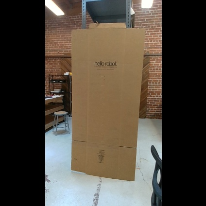
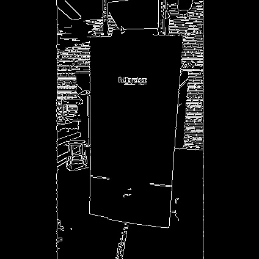

# Example 7

In this example, we will review the [image_view](http://wiki.ros.org/image_view?distro=melodic) ROS package and a Python script that captures an image from the RealSense camera.


<p align="center">
  
  

</p>


Begin by checking out the [feature/upright_camera_view](https://github.com/hello-robot/stretch_ros/tree/feature/upright_camera_view) branch in the stretch_ros repository. The configuration of the camera results in the images being displayed sideways. Thus, this branch publishes a new topic that rotates the raw image upright.

```bash
cd ~/catkin_ws/src/stretch_ros/stretch_core
git checkout feature/upright_camera_view
```
Then run the stretch driver launch file.

```bash
# Terminal 1
roslaunch stretch_core stretch_driver.launch
```

To activate the RealSense camera and publish topics to be visualized, run the following launch file in a new terminal.

```bash
# Terminal 2
roslaunch stretch_core d435i_low_resolution.launch
```

Within this tutorial package, there is an RViz config file with the topics for perception already in the Display tree. You can visualize these topics and the robot model by running the command below in a new terminal.

```bash
# Terminal 3
rosrun rviz rviz -d /home/hello-robot/catkin_ws/src/stretch_tutorials/rviz/perception_example.rviz
```

## Capture Image with image_view

There are a couple of methods to save an image using the image_view package.

**OPTION 1:** Use the `image_view` node to open a simple image viewer for ROS sensor_msgs/image topics.

```bash
# Terminal 4
rosrun image_view image_view image:=/camera/color/image_raw_upright_view
```
Then you can save the current image by right-clicking on the display window. By deafult, images will be saved as frame000.jpg, frame000.jpg, etc. Note, that the image will be saved to the terminal's current work directory.

**OPTION 2:** Use the `image_saver` node to save an image to the terminals current work directory.

```bash
# Terminal 4
rosrun image_view image_saver image:=/camera/color/image_raw_upright_view
```

## Capture Image with Python Script

In this section, you can use a Python node to capture an image from the RealSense camera. Run the following commands to save a .jpeg image of the image topic */camera/color/image_raw_upright_view*.

```bash
# Terminal 4
cd ~/catkin_ws/src/stretch_tutorials/src
python capture_image.py
```

An image named **camera_image.jpeg** is saved in the **stored_data** folder in this package.

### The Code
```python
#!/usr/bin/env python

import rospy
import sys
import os
import cv2

from sensor_msgs.msg import Image
from cv_bridge import CvBridge, CvBridgeError

class CaptureImage:
    """
    A class that converts a subscribed ROS image to a OpenCV image and saves
    the captured image to a predefined directory.
    """
    def __init__(self):
        """
        A function that initializes a CvBridge class, subscriber, and save path.
        :param self: The self reference.
        """
        self.bridge = CvBridge()
        self.sub = rospy.Subscriber('/camera/color/image_raw_upright_view', Image, self.callback, queue_size=1)
        self.save_path = '/home/hello-robot/catkin_ws/src/stretch_tutorials/stored_data'

    def callback(self, msg):
        """
        A callback function that converts the ROS image to a CV2 image and stores the
        image.
        :param self: The self reference.
        :param msg: The ROS image message type.
        """
        try:
            image = self.bridge.imgmsg_to_cv2(msg, 'bgr8')
        except CvBridgeError, e:
            rospy.logwarn('CV Bridge error: {0}'.format(e))

        file_name = 'camera_image.jpeg'
        completeName = os.path.join(self.save_path, file_name)
        cv2.imwrite(completeName, image)
        rospy.signal_shutdown("done")
        sys.exit(0)

if __name__ == '__main__':
    rospy.init_node('capture_image', argv=sys.argv)
    CaptureImage()
    rospy.spin()

```


### The Code Explained
Now let's break the code down.

```python
#!/usr/bin/env python
```
Every Python ROS [Node](http://wiki.ros.org/Nodes) will have this declaration at the top. The first line makes sure your script is executed as a Python script.


```python
import rospy
import sys
import os
import cv2
```

You need to import rospy if you are writing a ROS Node. There are functions from sys, os, and cv2 that are required within this code. cv2 is a library of Python functions that implements computer vision algorithms. Further information about cv2 can be found here: [OpenCV Python](https://www.geeksforgeeks.org/opencv-python-tutorial/).

```python
from sensor_msgs.msg import Image
from cv_bridge import CvBridge, CvBridgeError
```

The sensor_msgs.msg is imported so that we can subscribe to ROS Image messages. Import [CvBridge](http://wiki.ros.org/cv_bridge) to convert between ROS Image messages and OpenCV images.

```python
def __init__(self):
    """
    A function that initializes a CvBridge class, subscriber, and save path.
    :param self: The self reference.
    """
    self.bridge = CvBridge()
    self.sub = rospy.Subscriber('/camera/color/image_raw_upright_view', Image, self.callback, queue_size=1)
    self.save_path = '/home/hello-robot/catkin_ws/src/stretch_tutorials/stored_data'
```

Initialize the CvBridge class, the subscriber, and the directory of where the captured image will be stored.

```python
def callback(self, msg):
    """
    A callback function that converts the ROS image to a cv2 image and stores the
    image.
    :param self: The self reference.
    :param msg: The ROS image message type.
    """
    try:
        image = self.bridge.imgmsg_to_cv2(msg, 'bgr8')
    except CvBridgeError, e:
        rospy.logwarn('CV Bridge error: {0}'.format(e))
```

Try to convert the ROS Image message to a cv2 Image message using the `imgmsg_to_cv2()` function.  

```python
file_name = 'camera_image.jpeg'
completeName = os.path.join(self.save_path, file_name)
cv2.imwrite(completeName, image)
```

Join the directory and file name using the `path.join()` function. Then use the `imwrite()` function to save the image.

```python
rospy.signal_shutdown("done")
sys.exit(0)
```

The first line of code initiates a clean shutdown of ROS. The second line of code exits the Python interpreter.

```python
rospy.init_node('capture_image', argv=sys.argv)
CaptureImage()
```
The next line, rospy.init_node(NAME, ...), is very important as it tells rospy the name of your node -- until rospy has this information, it cannot start communicating with the ROS Master. In this case, your node will take on the name talker. NOTE: the name must be a base name, i.e. it cannot contain any slashes "/".

Instantiate the class with `CaptureImage()`

```python
rospy.spin()
```
Give control to ROS.  This will allow the callback to be called whenever new
messages come in.  If we don't put this line in, then the node will not work,
and ROS will not process any messages.


## Edge Detection

In this section, we highlight a node that utilizes the [Canny Edge filter](https://www.geeksforgeeks.org/python-opencv-canny-function/) algorithm to detect the edges from an image and convert it back as a ROS image to be visualized in RViz. Begin by running the following commands.

```bash
# Terminal 4
cd ~/catkin_ws/src/stretch_tutorials/src
python edge_detection.py
```

The node will publish a new Image topic named */image_edge_detection*. This can be visualized in RViz and a gif is provided below for reference.

<p align="center">
  
</p>

### The Code
```python
#!/usr/bin/env python

import rospy
import sys
import os
import cv2

from sensor_msgs.msg import Image
from cv_bridge import CvBridge, CvBridgeError


class EdgeDetection:
    """
    A class that converts a subscribed ROS image to a OpenCV image and saves
    the captured image to a predefined directory.
    """
    def __init__(self):
        """
        A function that initializes a CvBridge class, subscriber, and other
        parameter values.
        :param self: The self reference.
        """
        self.bridge = CvBridge()
        self.sub = rospy.Subscriber('/camera/color/image_raw_upright_view', Image, self.callback, queue_size=1)
        self.pub = rospy.Publisher('/image_edge_detection', Image, queue_size=1)
        self.save_path = '/home/hello-robot/catkin_ws/src/stretch_tutorials/stored_data'
        self.lower_thres = 100
        self.upper_thres = 200
        rospy.loginfo("Publishing the CV2 Image. Use RViz to visualize.")

    def callback(self, msg):
        """
        A callback function that converts the ROS image to a CV2 image and goes
        through the Canny Edge filter in OpenCV for edge detection. Then publishes
        that filtered image to be visualized in RViz.
        :param self: The self reference.
        :param msg: The ROS image message type.
        """
        try:
            image = self.bridge.imgmsg_to_cv2(msg, 'bgr8')
        except CvBridgeError, e:
            rospy.logwarn('CV Bridge error: {0}'.format(e))

        image = cv2.Canny(image, self.lower_thres, self.upper_thres)
        image_msg = self.bridge.cv2_to_imgmsg(image, 'passthrough')
        image_msg.header = msg.header
        self.pub.publish(image_msg)

if __name__ == '__main__':
	rospy.init_node('edge_detection', argv=sys.argv)
	EdgeDetection()
	rospy.spin()
```

### The Code Explained
Since that there are similarities in the capture image node, we will only breakdown the different components of the edge detection node.

```python
self.lower_thres = 100
self.upper_thres = 200
```
Define lower and upper bounds of the Hysteresis Thresholds.

```python
image = cv2.Canny(image, self.lower_thres, self.upper_thres)
```
Run the Canny Edge function to detect edges from the cv2 image.

```python
image_msg = self.bridge.cv2_to_imgmsg(image, 'passthrough')
```
Convert the cv2 image back to a ROS image so it can be published.

```python
image_msg.header = msg.header
self.pub.publish(image_msg)
```

Publish the ROS image with the same header as the subscribed ROS message.
