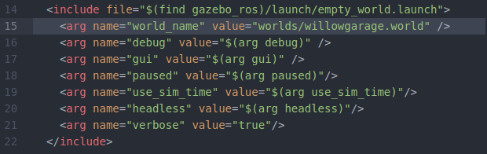

# Spawning Stretch in Simulation (Gazebo)

### Empty World Simulation
To spawn the Stretch in gazebo's default empty world run the following command in your terminal.
```
roslaunch stretch_gazebo gazebo.launch
```
This will bringup the robot in the gazebo simulation similar to the image shown below.

<!--  -->


### Custom World Simulation
With a modification of the gazebo launch file, you can spawn the Stretch robot in a custom world. In this instance, we will spawn Stretch in one of gazebo's world files named *willowgarage.world*.

To preserve the original gazebo.launch file, we will copy the file and rename it to the following.

```
cd catkin_ws/src/stretch_ros/stretch_gazebo/launch/
cp gazebo.launch stretch_willowgarage_world.launch
```

Modify the value for the world name argument like the following
```
<arg name="world_name" value="worlds/willowgarage.world" />
```
Use the images below for further reference.

**BEFORE**


**AFTER**


Make sure to save the file. Also, you can make the modifications to the file using your preferred text editor. Now you can run the new launch file with a Stretch robot in the willowgarage.world.

```
roslaunch stretch_gazebo stretch_willowgarage_world.launch
```


