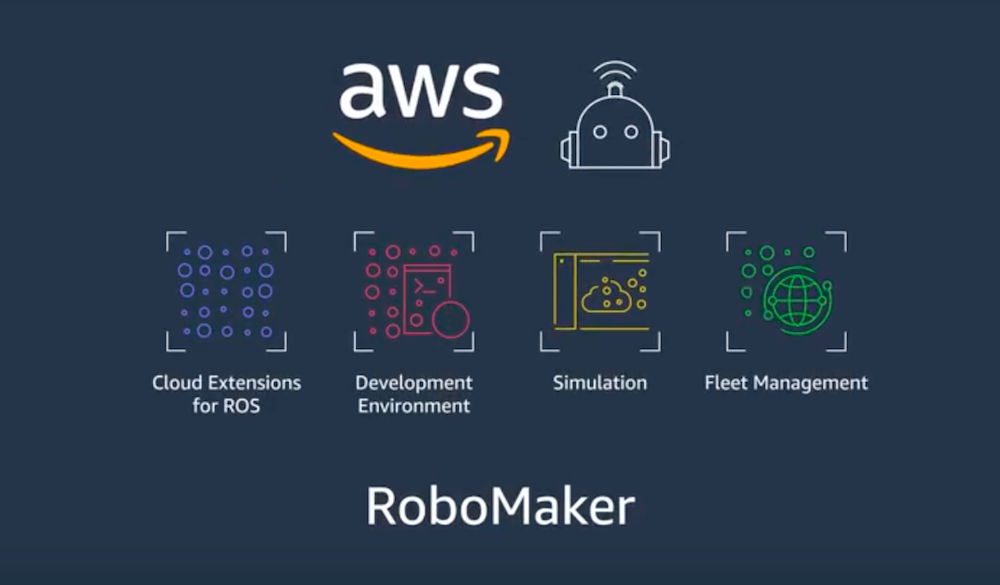

# Getting Started

## Ubuntu

Hello Robot utilizes Ubuntu, an open-source Linux operating system, for the Stretch RE1 platform. If you are unfamiliar with the operating system, we encourage you to review a [tutorial](https://ubuntu.com/tutorials/command-line-for-beginners#1-overview) provided by Ubuntu. Additionally, the Linux command line, BASH, is used to execute commands and is needed to run ROS on the Stretch robot. Here is a [tutorial](https://ryanstutorials.net/linuxtutorial/) on getting started with BASH.

## Creating Workspace
Create a catkin workspace for your ROS packages. Here is an [installation guide for creating a workspace](http://wiki.ros.org/catkin/Tutorials/create_a_workspace). Once your system is set up, clone the [stretch_tutorials](https://github.com/hello-robot/stretch_tutorials) to your workspace and build the package in your workspace. This can be done by copying the commands below and pasting them into your terminal.

```bash
cd ~/catkin_ws/src
git clone https://github.com/hello-robot/stretch_tutorials.git
cd ~/catkin_ws
catkin_make
```
### Connecting a Monitor
If you cannot access the robot through ssh due to your network settings, you will need to connect an HDMI monitor, USB keyboard, and mouse to the USB ports in the robot's trunk.

## ROS Setup on Local Computer

Hello Robot is running Stretch on Ubuntu 18.04 and ROS Melodic. To begin the setup, start with [installing Ubuntu desktop](https://ubuntu.com/tutorials/install-ubuntu-desktop#1-overview) on your local machine. Then follow the [installation guide for ROS Melodic](http://wiki.ros.org/melodic/Installation/Ubuntu) on your system.


After your system is setup, clone the [stretch_ros](https://github.com/hello-robot/stretch_ros.git), [stretch_tutorials](https://github.com/hello-robot/stretch_tutorials.git), and [realsense_gazebo_plugin packages]( https://github.com/pal-robotics/realsense_gazebo_plugin) to your **src** folder in your preferred workspace.
```bash
cd ~/catkin_ws/src
git clone https://github.com/hello-robot/stretch_ros
git clone https://github.com/pal-robotics/realsense_gazebo_plugin
git clone https://github.com/hello-robot/stretch_tutorials.git
```


Change the directory to that of your catkin workspace and install system dependencies of the ROS packages. Then build your workspace.
```bash
cd ~/catkin_ws
rosdep install --from-paths src --ignore-src -r -y
catkin_make
```


Once `caktin_make` has finished compiling,source your workspace and **.bashrc** file
```bash
echo "source /home/USER_NAME/catkin_ws/devel/setup.bash"
source ~/.bashrc
```

## RoboMaker

<p align="center">
  
</p>

If you cannot dual boot and install ubuntu on your local machine, an alternative is to use [AWS RoboMaker](https://aws.amazon.com/robomaker/). AWS RoboMaker extends the ROS framework with cloud services. The service provides a robotics simulation service, allowing for testing the Stretch RE1 platform. If you are a first-time user of AWS RoboMaker, follow the [guide here](https://github.com/aws-robotics/aws-robomaker-robotics-curriculum/blob/main/getting-started-with-aws-robomaker/_modules/mod-2a-aws.md) to get up and running with the service.

**Next Tutorial:** [Gazebo Basics](gazebo_basics.md)
