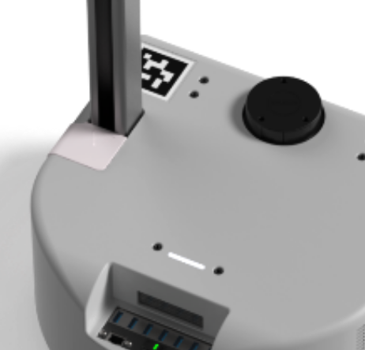

# Tutorial Track: Getting to Know Stretch
New to Stretch? Welcome!

Please take the time to get to know your robot by going through these tutorials in order.

## What Version of Robot Do I Have?

Stretch RE1, Stretch 2, and Stretch 3 are very similar. One quick way to tell the difference is to look at the robot's hostname:

```{.bash .shell-prompt}
hostname
```
```{.bash .no-copy}
--- OUTPUT ---
stretch-re2-2001
```

Another way is to look for the distinctive  pink stripe on the base of Stretch 2:



## Basics
|      | Tutorial                                    | Description                                        |
| ---- | ------------------------------------------- | -------------------------------------------------- |
| 1    | [Safety Guide](safety_guide.md)             | Guide to safe operation of the Stretch             |
| 2    | [Quick Start RE1](quick_start_guide_re1.md) | Unboxing Stretch RE1 and getting started           |
| 2    | [Quick Start Stretch 2](quick_start_guide_re2.md) | Unboxing Stretch 2 and getting started           |
| 3    | [Best Practices](best_practices.md)         | Best practices to keep Stretch charged and healthy |
| 4    | [Troubleshooting](troubleshooting_guide.md) | Solutions to common issues                         |

## Advanced
|   |Tutorial |  Description                                            |
|---|----------------------------------|---------------------------------------------------------|
| 1 | [Untethered Operation](untethered_operation.md) | Setting up your network to work with Stretch untethered |
| 2 | [Updating Software](updating_software.md)       | How to periodically update the Stretch software         |

------
<div align="center"> All materials are Copyright 2022 by Hello Robot Inc. Hello Robot and Stretch are registered trademarks.</div>
