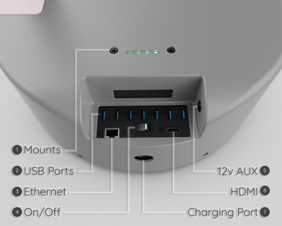
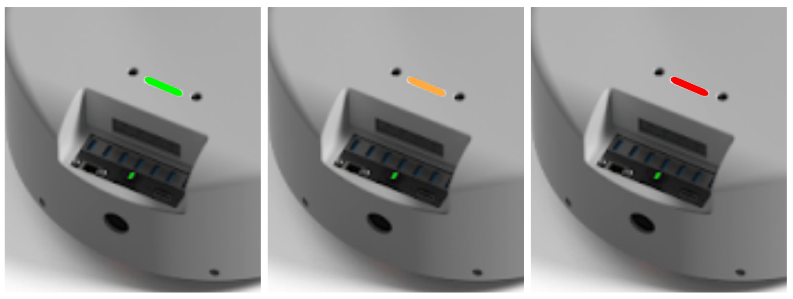
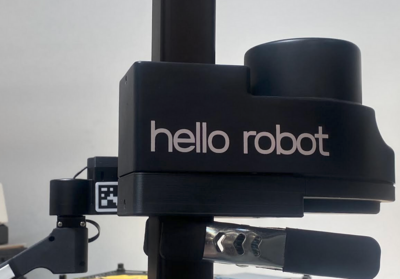
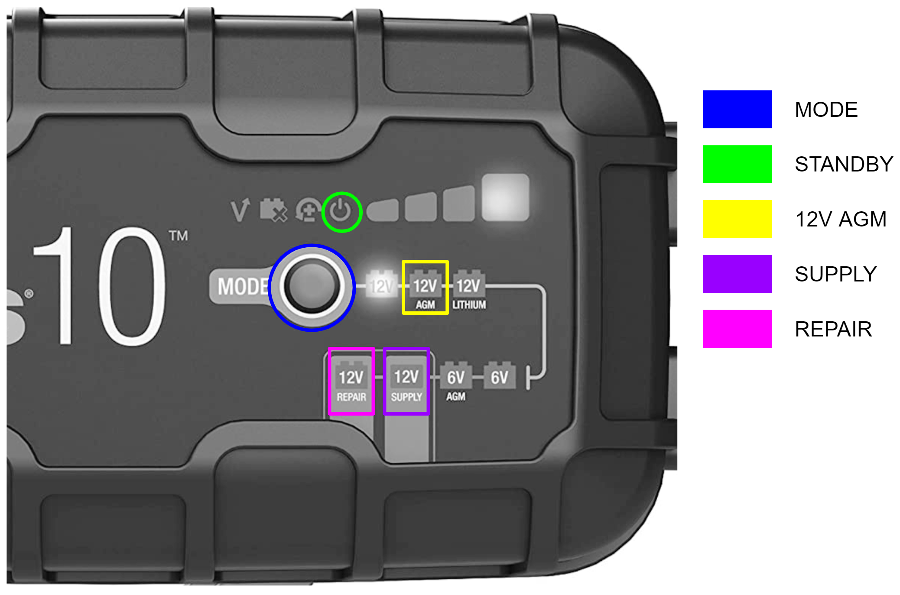
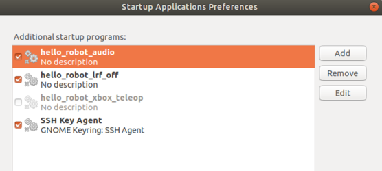

# Stretch 2: Quick Start Guide

Congratulations on your Stretch 2! This guide will get you started with your new robot. 

## Safety

Stretch has the potential to cause harm if not properly used. All users should review the [Stretch Safety Guide](./safety_guide.md) before operating the robot.

## Unboxing

Please watch the [Stretch Unboxing Video](https://youtu.be/O-6VrqqGlig). Please note that the unboxing instructions for a Stretch 2 are the same as for a Stretch RE1.

## Robot Tour

A few items you'll want to know about before getting started.

### Power

The entire robot powers up and down with the On/Off switch. When powering down, we recommend selecting 'Power Off' from the Ubuntu Desktop prior to hitting the Off switch



### Runstop

The illuminated button on the head is its Runstop. Just tap it, you'll hear a beep and it will start flashing. This will pause the motion of the primary robot joints during operation. This can be useful if the robot makes an unsafe motion, or if you just want to free up the robot motors while you roll it around.

To allow motion once again, hold the button down for two seconds. After the beep, the motion can resume.


### LED Lightbar

The LED lightbar in the base provides a simple way to quickly ascertain the robot's state. At all times its color indicates the battery voltage. 



More information on the voltage display is available in the [Battery Maintenance Guide](https://docs.hello-robot.com/0.2/stretch-hardware-guides/docs/battery_maintenance_guide_re2/#state-of-battery-charge)

The lightbar will also flash as follows:

| Mode               | Flashing              |
|--------------------|-----------------------|
| Normal Operation   | None                  |
| Runstopped         | Rapid flash at 1 Hz   |
| Charger plugged in | Slow strobe at 0.5 Hz |

## Hello World Demo

Stretch comes ready to run out of the box. The Xbox Teleoperation demo will let you quickly test out the robot's capabilities by teleoperating it with an Xbox Controller. 


**Note**: You will find the USB Dongle already plugged into the USB port of the base trunk.

To start the demo after unboxing and turning the power on:

* Wait for about 45 seconds. You will hear the Ubuntu startup sound, followed by two beeps (indicating the demo is running). 
* Hit the Connect button on the controller. The upper two LEDs of the ring will illuminate.
* Hit the Home Robot button. Stretch will go through its homing calibration routine. 
  * **Note**: make sure the space around the robot is clear before running the Home function

You're ready to go! A few things to try:

* Hit the Stow Robot button. The robot will assume the stow pose.
* Practice driving the robot around. 
* Pull the Fast Base trigger while driving. When stowed, it will make Stretch drive faster
* Manually stop the arm or lift from moving to make it stop upon contact.
* Try picking up your cellphone from the floor 
* Try grasping a cup from a countertop
* Try delivering an object to a person

If you're done, let's power down. First, attach the clip-clamp just below the shoulder as shown.


Hold down the Shutdown PC button on the Xbox controller for 2 seconds. This will cause the PC to turn off. You can then power down the robot with the On/Off switch. 

Now that you're familiar with the robot, take a minute to watch the [Stretch Powered Best Practices Video](https://youtu.be/iEaapHNfEWA). Please note that the best practice instructions for a Stretch 2 are the same as for a Stretch RE1.

### Safe Handling

Like any robot, it is possible to break Stretch if you're not careful. Use common sense when applying forces to its joints, transporting it, etc. 

The [Stretch Unpowered Best Practices Video](https://youtu.be/mQdOGEksdYM) provides a quick overview of how to work with the robot. Please note that the best practice instructions for a Stretch 2 are the same as for a Stretch RE1.

**Things that won't hurt the robot**:

* Manually push and pull the arm (when the motor isn't holding a position).
* Manually raise and lower the lift (when the motor isn't holding a position).
* Manually tilt and roll the base around (when the motors aren't holding a position).
* Pick up and carry Stretch (while holding it by the mast, two people for safety).

**Things to be mindful of**:

* Manually moving the head and wrist. They will move but they want to go at their own speed.
* The lift will slowly descend when the robot is powered off. If the arm is retracted it may come to rest the tool on the base. If desired to hold the arm up when un-powered, the provided 'clip-clamp' can be clipped onto the mast below the shoulder to support it. 

**NOTE**: The Stretch 2 lift descends faster than the Stretch RE1. For Stretch 2 we recommend always attaching the clip-clamp before powering down the NUC computer

**Things that can hurt the robot**: 

* Driving the wrist and gripper into the base. When the arm and wrist are stowed it is possible to collide the two.
* Getting the gripper stuck on something and then driving the arm, lift, or base. 
* Laying the robot down with its weight on its camera.
* Trying to ride on the robot, getting it wet, etc. (eg, common sense)

### Charging the Battery

The provided battery charger can be plugged and unplugged at any time during operation. Stretch uses the following charger modes:

| Mode    | Function                                                     |
| ------- | ------------------------------------------------------------ |
| STANDBY | Charger not charging the robot                               |
| 12V AGM | Charging while robot is powered down                         |
| SUPPLY  | 1) Power the robot during tethered use<br/>2) Repair damaged batteries. |
| REPAIR  | Repair damaged batteries.                                    |

Please review the [Battery Maintenance Guide](https://docs.hello-robot.com/0.2/stretch-hardware-guides/docs/battery_maintenance_guide_re2/) for proper care and charging of Stretch batteries. 



## Get Plugged In

Let's get plugged in.
* Power up the robot
* Plug in a mouse, keyboard and HDMI monitor to the robot trunk
* Plug in the battery charger
* Place the charger in SUPPLY mode

Log in to the robot computer. The default user credentials came in the box with the robot. 

## Start Coding

Python is the easiest way to begin writing code for the robot. This section will give you a quick look at Stretch Body, which is the low-level Python interface to the robot. Detailed information on the [Stretch Body Interface](../stretch_body/README.md) can be found here.

**NOTE**: Stretch is configured to run the Xbox Controller demo in the background at startup. To run your own code you'll need to kill this process so that it doesn't contend with your code.

```{.bash .shell-prompt}
$ pkill -f stretch_xbox*
```

While you're at it, disable this autoboot feature. You can always turn it back on later. 

Search for 'Startup' from Ubuntu Activities. Uncheck the box for 'hello_robot_xbox_teleop' 



Now open up a Terminal. From the command line, first, verify that all of the hardware is present and happy

```{.bash .shell-prompt}
$ stretch_robot_system_check.py
```

You may see a few joints reported in red because they haven't yet been calibrated. If so, home the robot

```{.bash .shell-prompt}
$ stretch_robot_home.py
```

Once the robot has homed, let's write some quick test code:

```{.bash .shell-prompt}
$ ipython
Python 3.8.10 (default, Jun 22 2022, 20:18:18) 
...
```

Now let's move the robot around using the [Stretch Body Robot API](https://github.com/hello-robot/stretch_body/blob/master/body/stretch_body/robot.py). Try typing in these interactive commands at the iPython prompt:

```python
>>$ ipython
...
import stretch_body.robot
robot=stretch_body.robot.Robot()
robot.startup()

robot.stow()

robot.arm.move_to(0.25)
robot.push_command()

robot.arm.move_to(0.0)
robot.push_command()

robot.lift.move_to(0.4)
robot.push_command()

robot.pretty_print()

robot.lift.pretty_print()

robot.head.pose('tool')
robot.head.pose('ahead')

robot.end_of_arm.move_to('wrist_yaw',0)

robot.end_of_arm.move_to('stretch_gripper',50)
robot.end_of_arm.move_to('stretch_gripper',-50)

robot.stow()
robot.stop()
```

## Change Credentials

Finally, we recommend that you change the login credentials for the default user, hello-robot. 

```{.bash .shell-prompt}
$ sudo passwd hello-robot
```

If you'd like to set up a new user account, check out the [Stretch Installation Guide](https://github.com/hello-robot/stretch_install/blob/master/README.md). In a lab setting, it's useful for lab members to have their own user accounts to run experiments.

## Power Down

The recommended power-down procedure is

1. Place a clamp on the mast below the shoulder to prevent a slow drop (if this is a concern)
2. Shutdown the computer from the Desktop
3. When the laser range finder has stopped spinning, turn off the main power switch
4. Attach the charger
5. Place the charger in 12V AGM mode

## Join the Community Forum

Join the [Hello Robot Community](https://forum.hello-robot.com). We'd welcome hearing your feedback as you get to know your robot.

Hello Robot support monitors the forum closely and will quickly get back to you on any questions or issues you post.

## Further Exploration

Encounter any issues while getting started? Please let us know at support@hello-robot.com. Also, take a minute to review the [Stretch Troubleshooting Guide](./troubleshooting_guide.md)

We recommend next exploring the ROS-based demos that ship with Stretch.  These [are found in the stretch_ros repository](https://docs.hello-robot.com/0.2/stretch-ros/stretch_demos/).

That's it. Happy coding!

------
<div align="center"> All materials are Copyright 2022 by Hello Robot Inc. Hello Robot and Stretch are registered trademarks.</div>

