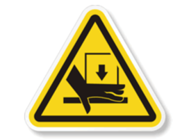
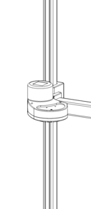
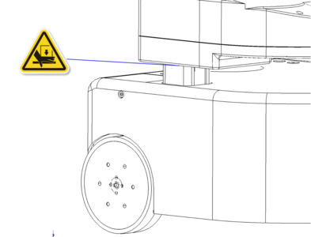
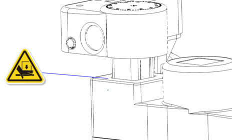

# Robot Safety Guide

The Stretch robots are potentially dangerous machines with safety hazards. **If improperly used they can cause injury or death.** 

* **All users must carefully read the following safety information before using the robot.**
* Anyone near the robot who has not read this safety information must be closely supervised at all times and made aware that the robot could be dangerous.
* Only use the robot after inspecting the surrounding environment for potential hazards.

## Intended Use

**The Stretch robots are intended for use by researchers to conduct research in controlled indoor environments.** This product is not intended for other uses and lacks the required certifications for other uses, such as use in a home environment by consumers.

## Safety Hazards

As described later in this document, we have designed Stretch to be safer than previous commercially-available human-scale mobile manipulators, so that researchers can explore the future of mobile manipulation. For example, we have made it smaller and lighter weight with backdrivable torque-sensing joints that can stop when they detect contact.

Nonetheless, Stretch is a research robot that can be dangerous. Researchers must use Stretch carefully to avoid damage, injury, or death. Here, we list several safety hazards that researchers must consider before and while using Stretch. 

### Stretch Can Put People And Animals At Risk

As described in more detail later, Stretch can put people and animals at risk. People and animals near the robot must be closely supervised at all times. At all times, an experienced researcher must carefully monitor the robot and be prepared to stop it. Any people near the robot must be made aware that the robot could be dangerous. Before any use of the robot near people or animals, researchers must carefully assess and minimize risks.  

**Researchers who use the robot near children, animals, vulnerable adults, or other people do so at their own risk. Researchers must take appropriate precautions and obtain the required approvals from their organizations.**

### Stretch Can Topple Onto A Person

The robot may drive off stairs, push or pull itself over with its telescoping arm, fall over while attempting to traverse a threshold or encounter obstacles that cause it to fall on or otherwise collide with people, causing injury. 

**Operate the robot only on flat surfaces away from stairs or other obstacles that may cause it to topple, and do not allow the robot to push or pull itself over.**

### Stretch Should Not Be Lifted By A Single Person

Stretch with the standard gripper weighs about 23 kg (50.5 lb), so two or more people should lift and carry the robot. A single person can move the robot around by enabling the runstop button, tilting it over, and rolling it on flat ground. 

**At least two people should lift and carry the robot when needed.**

### Stretch Can Cause Lacerations
The robot's wrist and tool have sharp edges that can cause lacerations or punctures to the skin or the eyes. 

**Operate the robot away from eyes and other sensitive body parts.**

### Stretch Can Trap, Crush, Or Pinch Body Parts

The robot has moving joints that can trap, crush or pinch hands, fingers, or other body parts. The robot could also injure a person or animal by driving over a body part. 

**Keep body parts away from the trap, crush, and pinch points during robot motion, including underneath the wheels.**

### Stretch Can Entrap Loose Clothing Or Hair

The robot's shoulder and telescoping arm have rollers that can pull in and entrap loose clothing or hair. 

**Keep loose clothing and long hair away from the robot's shoulder and telescoping arm when either is in motion.**

### Stretch Has Flammable Components

The robot has polyurethane covers that are flammable and must be kept away from potential ignition sources, such as open flames and hot surfaces. The robot’s head, shoulder, and mobile base have polyurethane covers. 

**Keep the robot away from potential ignition sources and always have a working fire extinguisher nearby.**

### Stretch Is An Electrical Device

Stretch has batteries, electronics, wires, and other electrical components throughout its body. It also provides uncovered connectors that provide power. While the robot has fuses to reduce electrical risks, users must be careful. 

**Keep the robot dry and away from liquids, avoid electrical shocks, ensure power cables and wires are in good condition, be careful with the robot’s connectors, and generally exercise caution while working with this electrical device.**

### Stretch Can Perform Dangerous Activities

Stretch is a versatile robot capable of performing many actions, including actions that would be dangerous to people. For example, if a dangerous object is held by or affixed to the robot, such as a knife, a heavy object, or breakable glass, the robot can become very dangerous. Likewise, the robot is capable of physically altering the environment in ways that would be dangerous, such as turning a knob that releases gas from a gas stove. 

**Users must be cautious while using the robot to ensure it interacts safely with people and the surrounding environment.**

### Stretch Is An Open Platform That Can Be Made More Dangerous

Stretch is an open platform with user-modifiable and user-extensible hardware and software. User changes to the hardware or software can entail serious risks. For example, when shipped, the robot has conservative settings that restrict its speed and the forces it applies to reduce the risks associated with the robot. By modifying the robot, users could enable the robot to move at unsafe speeds and apply unsafe forces. As another example, improper electrical connections could result in a fire. 

**Researchers who choose to modify or extend the robot’s hardware or software do so at their own risk and should be careful to understand the implications of their modifications or extensions. Changes to the robot could result in dangerous situations that cause injury or death.**

## Additional Risks

**The most important aspects of safety with Stretch are to use good judgment and common sense.** Additional important considerations follow:

* **If the robot appears to be damaged, stop the robot immediately.**
* **Always be ready to stop the robot.**
* **Do not operate the robot unless an experienced user is present and attentive.**
* Be aware that the robot can move in unexpected ways.
* Do not put fingers or other objects into the channel that runs along the length of the mast. A belt moves within this channel.
* Keep an eye on cords, rugs, and any other floor hazards as the robot drives.
* Keep the robot at least 3 meters from ledges, curbs, stairs, and any other toppling hazard.
* Do not operate the robot outdoors.
* Do not attempt to ride the robot.
* Do not have the robot hold sharp objects.
* Do not attempt to service the robot without supervision by Hello Robot.

## Other Problems Will Likely Occur

>“**Anticipate potential problems** and hazards. Always imagine what might
>happen if the robot malfunctions or behaves in a way different from the desired
>action. Be vigilant.” - [PR2 User Manual](https://www.clearpathrobotics.com/assets/downloads/pr2/pr2_manual_r321.pdf) by Willow Garage from October 5, 2012

Stretch is a complex device that includes many mechanical, electrical, and computational systems that have been designed to work together. **Be prepared for something to go wrong.** For example, a motor control board might fail, software might not operate as anticipated, an unexpected process might still be running on the robot, or the batteries for the Xbox-style controller or the robot itself might run out. 

## Safety Features

We have considered safety from the outset in the design of Stretch. 

* **Runstop**: The illuminated runstop button on Stretch’s head can be used to pause the operation of the four primary joints (base, lift, and arm) of the robot when it is in motion. 
* **Lightweight design:** The overall mass of Stretch with the standard gripper is 23Kg (50.5lb), and the majority of the mass is in the base. The carbon fiber arm and aluminum mast make for a remarkably lightweight upper body. While this reduces the risk of crushing, crushing injuries can still occur and should be carefully monitored.
* **Gravity friendly**: Due to Stretch’s design, its actuators don't have to counteract gravity on a large lever arm. As a result, the motors and gearboxes are lower torque and lower weight than a conventional mobile manipulator with a comparable reach, avoiding the often dangerously strong shoulder joints of typical robot arms.
* **Low gear ratio**: The primary joints of Stretch (base, lift, and arm) have low gear-ratios (approx 5:1), allowing for backdriving of joints when powered off. A low gear-ratio also reduces the effective inertia of each joint, limiting the impacted force during undesired contact with people and the environment.
* **Contact Sensitivity**: The four primary joints of Stretch (base, lift, and arm) have contact sensitivity. We measure motor currents to estimate contact forces. Because Stretch is a low gear-ratio robot, current sensing provides a fairly sensitive measure of contact forces.
* **Firmware limits**: Motor torques are limited at the lowest level of the firmware to configured bounds.
* **Velocity limits**: Fast motions of the base are restricted when the arm is up high and the tool is outside the base footprint. This limits the likelihood of toppling or snagging the tool during base motion.
* **Tilt detection**: The robot can detect when its body is tilted beyond a safe threshold. The robot can be configured to trigger a runstop event during an over-tilt event.

## Safety Markings

Stretch has the following safety markings:
Top of the shoulder, indicating potential pinch point between rollers and mast.

Top of the base, indicating potential pinch point between arm and base.

## Runstop

The runstop allows the user to pause the motion of the four primary actuators (base, lift, and arm) by tapping the illuminated button on the head. An experienced operator should always keep the runstop within reach, allowing them to stop the motion of the robot if it is deemed unsafe.

!!! warning
    The runstop is not equivalent to an Emergency Stop found on industrial equipment and no safety guarantees are made by its function.

When the runstop is enabled, these actuators are in a ‘Safety Mode’ that inhibits the motion controller at the firmware level. Disabling the runstop allows normal operation to resume.

The runstop logic is:

<table>
  <tr>
    <td>Action</td>
    <td>Runstop State</td>
    <td>Button Illumination</td>
  </tr>
  <tr>
    <td>Robot startup</td>
    <td>Motion enabled</td>
    <td>Solid</td>
  </tr>
  <tr>
    <td>Tap runstop button</td>
    <td>Motion disabled</td>
    <td>Flashing at 1Hz</td>
  </tr>
  <tr>
    <td>Hold down runstop button for >2s</td>
    <td>Motion enabled</td>
    <td>Solid</td>
  </tr>
</table>

## Safety Hazard Details

### Sharp Edges

The Stretch robot is a piece of laboratory equipment. As such, its structure has moderately sharp edges and corners that can be unsafe. These edges can get snagged during motion, or they may cause lacerations when sufficient force is applied to a person. Care should be taken when grasping or otherwise making contact with Stretch that a sharp corner or edge is not contacted.

### Toppling

Stretch is a relatively lightweight robot. In some kinematic configurations, a high center of gravity can make it prone to toppling. Toppling can occur when:

*  The mobile base is moving at a moderate or fast speed and hits a bump, threshold, or other change in floor property.
*  The arm is raised high and pushes or pulls on the environment with sufficient force.
*  The robot drives over a drop-off such as a stair or a curb.

!!! warning
    While Stretch has cliff sensors, they do not currently inhibit motion of the base. During typical use, the robot will not attempt to stop itself at a cliff, and can fall down stairs and hurt itself or a person.

### Pinch Points

Pinch points around the robot's head, gripper, and wrist can cause discomfort and care should be taken when handling these joints as they move.

The shoulder, which travels up and down on the lift, has a series of rollers that ride along the mast. While the shoulder shells can prevent large objects from getting pinched by the rollers, small and thin objects can be pulled into and crushed.

The telescoping arm, which extends and retracts, has rollers that ride along the telescoping elements. While the arm link cuffs can reduce the chance of large objects getting pinched, small and thin objects, such as hair, can be pulled in.

Extra care should be taken with long hair, clothing, and small fingers around the shoulder rollers.

### Crush Points

The lift degree of freedom is the strongest joint on the robot and as such can apply potentially unsafe forces to a person.

The lift, while in motion, may trap or crush objects between the ‘shoulder’ and another surface. As such, best practices for lift safety should always be used when using the lift degree of freedom.  

The lift has a max theoretical strength of nearly 200N of linear force. In practice, this force is limited by the lift’s Guarded Move function, which places the lift in Safety Mode when the actuator forces exceed a threshold. 

The diagrams below show the potential crush points at the top and bottom of the lift range of motion.

------

 All materials are Copyright 2022 by Hello Robot Inc. Hello Robot and Stretch are registered trademarks.
