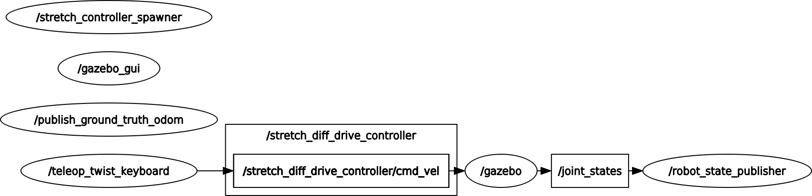

## Getting the State of the robot

Begin by starting up [Stretch in simulation](getting_started) and the [keyboard teleoperation](teleoperating_stretch.md). Then utilize the ROS command-line tool, [rostopic](http://wiki.ros.org/rostopic), to display Stretch's internal state information. For instance, to view the current state of the robot's joints, simply type the following in a terminal.
```
rostopic echo /joint_states -n1
```
Note that the flag, `-n1`, at the end of the command, defines the count of how many times you wish to publish the current topic information. If you prefer to continuously print the topic for debugging purposes, then remove the flag.

Your terminal will then output the information associated with the `/joint_states` topic. Your `header`, `position`, `velocity`, and `effort` information may vary from what is printed below.
```
header:
  seq: 70999
  stamp:
    secs: 1420
    nsecs:   2000000
  frame_id: ''
name: [joint_arm_l0, joint_arm_l1, joint_arm_l2, joint_arm_l3, joint_gripper_finger_left,
  joint_gripper_finger_right, joint_head_pan, joint_head_tilt, joint_left_wheel, joint_lift,
  joint_right_wheel, joint_wrist_yaw]
position: [-1.6137320244357253e-08, -2.9392484829061376e-07, -2.8036125938539207e-07, -2.056847528567165e-07, -2.0518734302754638e-06, -5.98271107676851e-06, 2.9291786329821434e-07, 1.3802900147297237e-06, 0.08154086954434359, 1.4361499260374905e-07, 0.4139061738340768, 9.32603306580404e-07]
velocity: [0.00015598730463972836, -0.00029395074514369584, -0.0002803845454217379, 1.322424459109634e-05, -0.00035084643762840415, 0.0012164337445918797, 0.0002138814988808099, 0.00010419792027496809, 4.0575263146426684e-05, 0.00022487596895736357, -0.0007751929074042957, 0.0002451588607332439]
effort: [0.0, 0.0, 0.0, 0.0, 0.0, 0.0, 0.0, 0.0, 0.0, 0.0, 0.0, 0.0]
---
```

Let's say you are intersted in only seeing the `header` component of the `/joint_states` topic, you can parse this within the rostopic command-line tool by typing the following command.
```
rostopic echo /joint_states/header -n1
```
Your terminal will then output something similar to this:

```
seq: 97277
stamp:
  secs: 1945
  nsecs: 562000000
frame_id: ''
---
```

Additionally, if you were to type `rostopic echo /` in the terminal, then press your *Tab* key on your keyboard, you will see the list of active topics being published.

A powerful tool to visualize the ROS communication is the ROS [rqt_graph package](http://wiki.ros.org/rqt_graph). You can see a graph of topics being communicated between nodes by typing the following.

```
rqt_graph
```


The graph allows a user to observe and affirm if topics are broadcasted to the correct nodes. This method can also be utilized to debug communication issues.

**Next Tutorial:** [Rviz Basics](rviz_basics.md)
