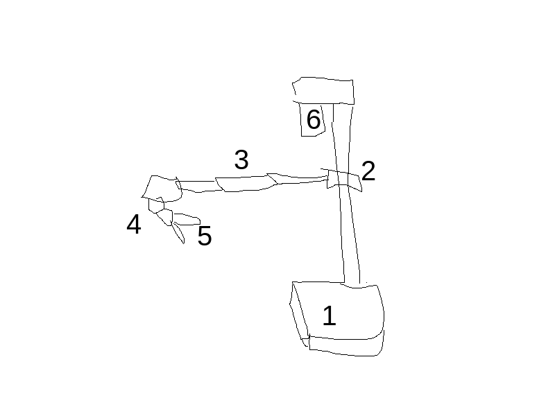
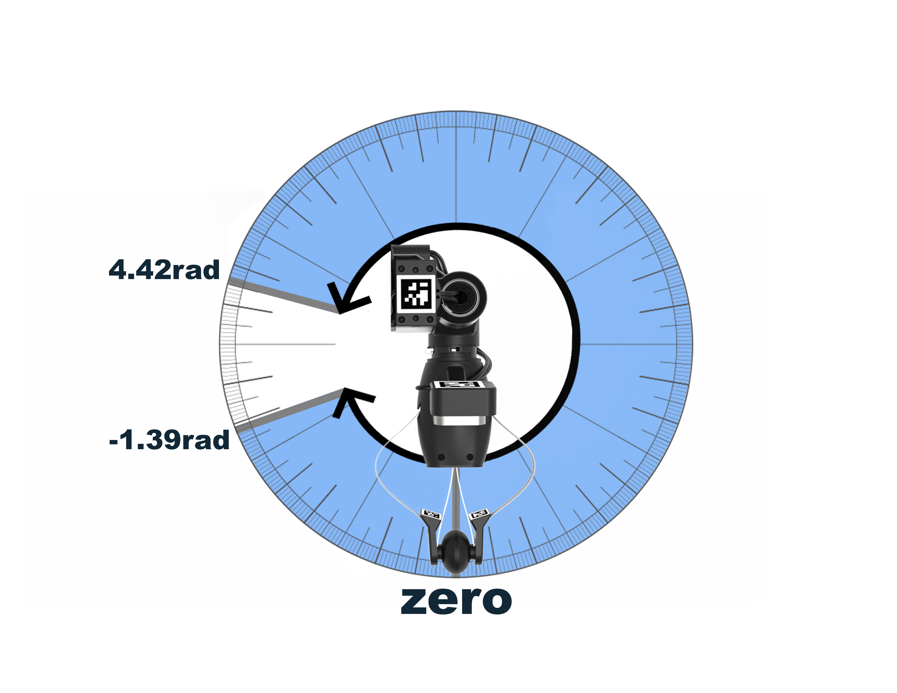
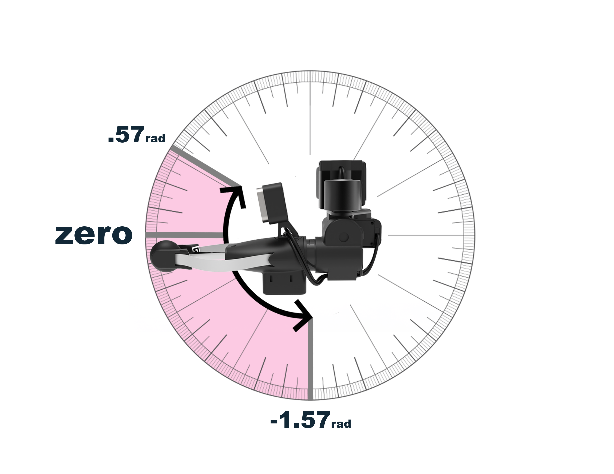
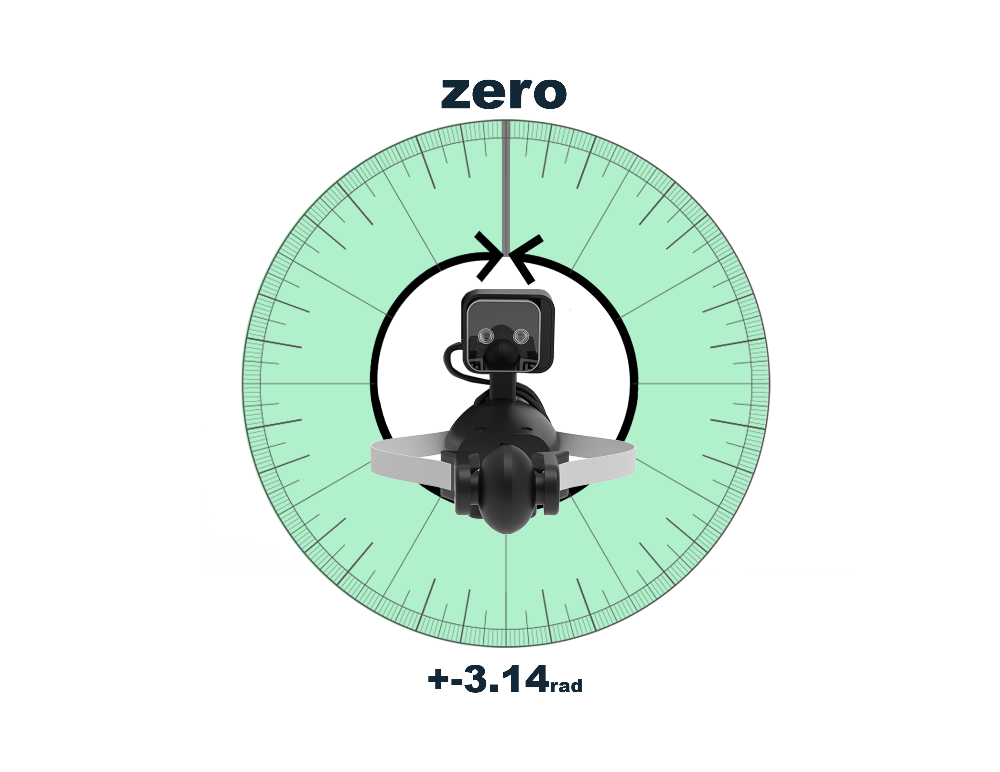
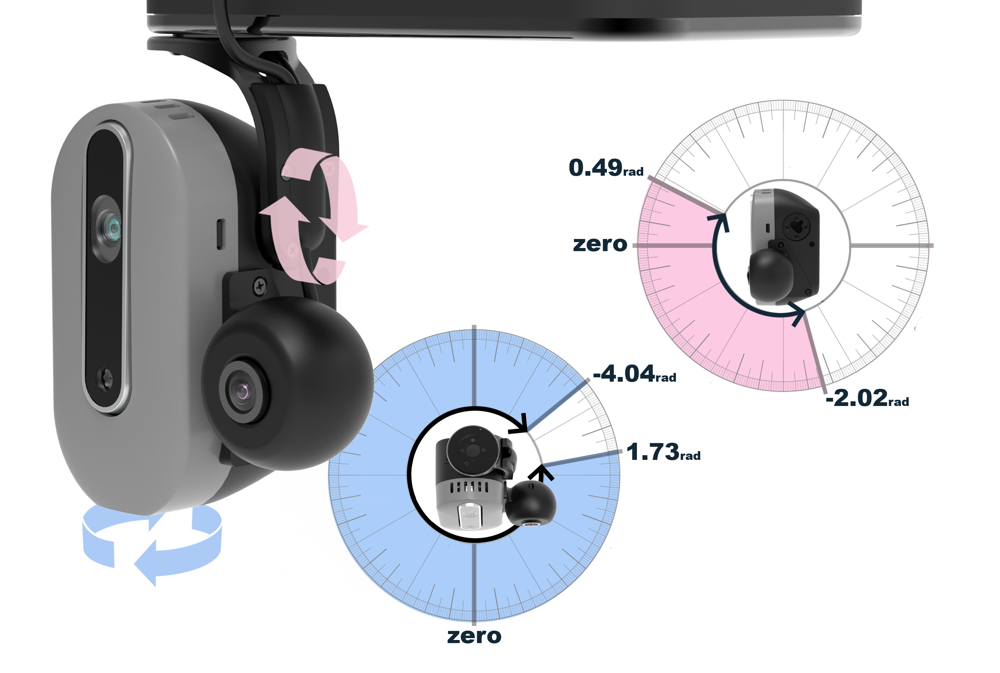

# Commanding Stretch to Move

This tutorial covers sending various kinds of motion commands to Stretch.

## Introducing Stretch Body

"Stretch Body" is a Python library for Stretch. It's already installed on your robot. The library gives you an interface to command Stretch's body to move. We start by creating an instance of the `stretch_body.robot.Robot` class.

```python
import stretch_body.robot

r = stretch_body.robot.Robot()
```

The hardware can only talk to one instance at a time, so if you see an `Another process is already using Stretch. Try running "stretch_free_robot_process.py"` error, you'll need to close the other application or use the `stretch_free_robot_process.py` CLI to free up the hardware.

Next, we'll call the `startup()` method, which opens USB communication with the hardware, loads the parameters that dictate robot behavior, and launches a few helper threads to poll for status in the background.

```python
did_startup = r.startup()
print(f'Robot connected to hardware: {did_startup}')
```

To close down the connection to the hardware, use `stop()`. Next, we'll check if the robot is "homed", i.e. the robot knows the zero position for each joint.

```python
is_homed = r.is_homed()
print(f'Robot is homed: {is_homed}')
```

To execute the homing procedure, use `home()`. Ensure the robot has space around it.

## Sending Position Commands

Stretch has the following joints:

<!-- TODO: { width="500" loading=lazy } -->

 1. Left and right wheels, constituting a differential drive
 1. Pristmatic vertical lift
 1. Prismatic telescoping horizontal arm
 1. Up to three revolute joints in the wrist: yaw, pitch, and roll
    - Print out `r.end_of_arm.joints` to see which joints your Stretch has
 1. Gripper
 1. Two revolute joints in the head: pan & tilt

Each of these joints are accessible as an attribute of the `Robot` object.

```python
# The mobile base:
print(r.base)

# The arm/lift:
print(r.arm, r.lift)

# The wrist/gripper
print(r.end_of_arm)

# The head
print(r.head)
```

Use the `move_to(pos)` method under each joint to queue up a command.

```python
r.arm.move_to(0.2) # 0.2 meters
r.lift.move_to(0.6) # 0.6 meters
```

The arm and lift won't move yet. The commands have been queued up, but the hardware will wait to begin moving until we call `push_command()`.

```python
r.push_command()
```

The mobile base doesn't have a move method. Instead, its methods are `translate_by(delta)` and `rotate_by(delta)`.

```python
r.base.translate_by(0.2) # 0.2 meters
r.push_command()
r.base.rotate_by(0.1) # 0.1 radians
r.push_command()
```

You'll notice the base doesn't translate forward by 0.2m. Instead, it skips to rotating counter-clockwise by 0.1rad. This happens because `push_command()` is asynchronous (i.e. the method returns immediately, and the program flow continues immediately to execute the rotation command). Use the `wait_command()` method to wait for the command to complete execution.

```python
r.base.translate_by(0.2) # 0.2 meters
r.push_command()
r.wait_command()

r.base.rotate_by(0.1) # 0.1 radians
r.push_command()
r.wait_command()
```

The wrist and head joints are Dynamixel servos. Their API is `move_to(name, pos)`, and their commands aren't queued. They execute immediately.

```python
print(f'Wrist joints: {r.end_of_arm.joints}') # ['wrist_yaw', 'wrist_pitch', 'wrist_roll', 'stretch_gripper']
r.end_of_arm.move_to('wrist_yaw', 1.57)
```

`wait_command()` will still work here. The gripper uses the same `move_to(name, pos)` API, and accepts values between -100 to 100, where the gripper is fully closed at -100 and fully open at 100.

```python
r.end_of_arm.move_to('stretch_gripper', 100)
```

## Querying Stretch's current joint state

The current state of each joint is available in a Python dictionary called `status` under each joint.

```python
# Wheel odometry
print(r.base.status['x'], r.base.status['y'], r.base.status['theta']) # (x meters, y meters, theta radians)

# Arm/lift positions
print(r.arm.status['pos'], r.lift.status['pos']) # (arm meters, lift meters)
```

The wrist and head joints are Dynamixel servos. Their `status` dictionary is under the `get_joint(name)` method.

```python
# Wrist positions
print(f'Wrist joints: {r.end_of_arm.joints}')
print(r.end_of_arm.get_joint('wrist_yaw').status['pos']) # radians

# Head positions
print(f'Head joints: {r.head.joints}')
print(r.head.get_joint('head_pan').status['pos']) # radians
```

## Querying Stretch's joint limits

Whereas the mobile base is unbounded (i.e. `translate_by(delta)` can take any value for delta), the rest of the joints have joint limits. They are available as part of the `soft_motion_limits` dictionary.

### Arm & Lift

{ width="500" loading=lazy }

```python
print(r.lift.soft_motion_limits['hard']) # (lower bound in meters, upper bound in meters)
print(r.arm.soft_motion_limits['hard'])
```

`soft_motion_limits` is a dictionary with four keys: "collision", "user", "hard", and "current". Each key maps to a `[lower bound, upper bound]` tuple. "collision" is used by Stretch Body's self collision avoidance algorithm to set *soft*ware limits on the joint. "user" is used by you, the user, to set application specific software joint limits. "hard" is the hardware limits of the joint. And "current" is the aggregate of the previous three limits into the final limits enforced by the software.

### Wrist Joints

| Yaw        | Pitch  | Roll |
| ----------- | ------ | ------- |
| { loading=lazy }   | { loading=lazy } | { loading=lazy } |

```python
print(r.end_of_arm.get_joint('wrist_yaw').soft_motion_limits['hard']) # (lower bound in radians, upper bound in radians)
print(r.end_of_arm.get_joint('wrist_pitch').soft_motion_limits['hard'])
print(r.end_of_arm.get_joint('wrist_roll').soft_motion_limits['hard'])
```

### Head Joints

{ width="500" loading=lazy }

```python
print(r.head.get_joint('head_pan').soft_motion_limits['hard']) # (lower bound in radians, upper bound in radians)
print(r.head.get_joint('head_tilt').soft_motion_limits['hard'])
```

## Sending Velocity Commands

Each joint accepts velocity commands via the `set_velocity(vel)` API.

```python
r.arm.set_velocity(0.01) # extends 1 cm/s
r.push_command()
```

Once again, Dynamixel joints push their commands immediately.


```python
r.end_of_arm.get_joint('wrist_yaw').set_velocity(0.1) # rotate CCW at 0.1 rad/s
```

The base can execute translational (`v`) and rotational (`ω`) velocity simultaneously via `set_velocity(v, ω)`. You will often see navigation motion planners choose to control mobile bases with `v` and `ω` velocities.

```python
r.base.set_velocity(0.01, 0.05) # follow a circular path
r.push_command()
```

## Following Cubic/quintic Splines

Stretch's joints can follow trajectories defined as splines. You will often see geometric motion planners, graphics software (e.g. Blender, Unity3D), and motion capture systems choose to formulate robot trajectories as splines. Spline trajectories are a series of position waypoints, associated with a time at which the joint should reach the position, and optionally associated with a velocity/acceleration that the joint should be traveling at when it passes the waypoint.

Each joint has a `trajectory` attribute that is an instance of either `stretch_body.trajectories.RevoluteTrajectory` (for the wrist & head joints), `stretch_body.trajectories.PrismaticTrajectory` (for the arm & lift), or `stretch_body.trajectories.DiffDriveTrajectory` (for the base). Adding waypoints looks like:

```python
r.arm.trajectory.add(t_s=0.0, x_m=0.0, v_m=0.0)
r.arm.trajectory.add(t_s=10.0, x_m=0.5, v_m=0.0)
r.arm.trajectory.add(t_s=20.0, x_m=0.0, v_m=0.0) # 20 second trajectory extending & retracting the arm
```

Then begin tracking the trajectory using:

```python
r.follow_trajectory()
```

Trajectories are preemptive. You can edit the future waypoints in a trajectory while the robot is actively tracking it. For example, geometric planners can use this adapt to changing environments.

You can stop a trajectory early using `stop_trajectory()`.

### Coordinated Motion through Trajectories

Check out the [Creating smooth motion using trajectories](https://forum.hello-robot.com/t/creating-smooth-motion-using-trajectories/671) tutorial for more info on creating coordinated joint movements.
