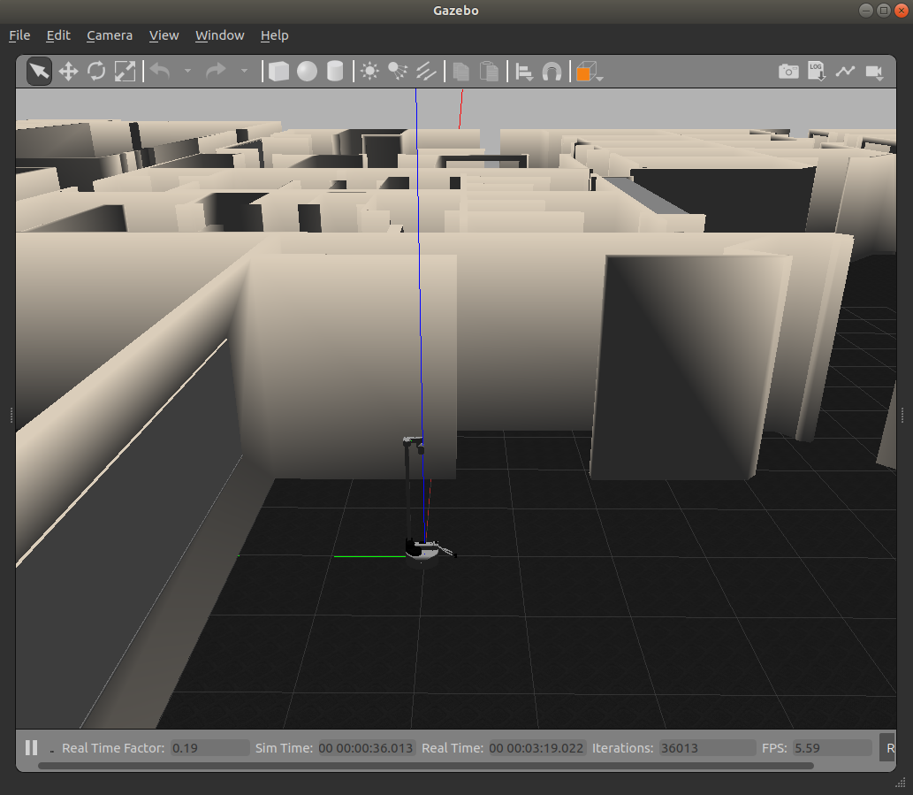

# Spawning Stretch in Simulation (Gazebo)

### Empty World Simulation
To spawn the Stretch in gazebo's default empty world run the following command in your terminal.
```bash
roslaunch stretch_gazebo gazebo.launch
```
This will bringup the robot in the gazebo simulation similar to the image shown below.

<p align="center">
  
</p>

### Custom World Simulation
In gazebo, you are able to spawn Stretch in various worlds. First, source the gazebo world files by running the following command in a terminal
```bash
echo "source /usr/share/gazebo/setup.sh"
```


Then using the world argument, you can spawn the stretch in the willowgarage world by running the following

```bash
roslaunch stretch_gazebo gazebo.launch world:=worlds/willowgarage.world
```

<p align="center">
  
</p>
