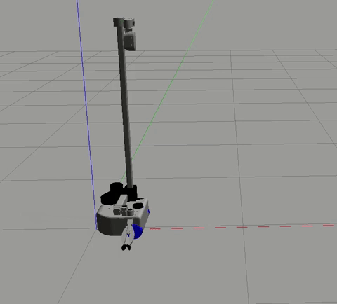

## Example 1
!!! note
	ROS 2 tutorials are still under active development. 

<p align="center">
  
</p>

The goal of this example is to give you an enhanced understanding of how to control the mobile base by sending `Twist` messages to a Stretch robot.

```{.bash .shell-prompt}
ros2 launch stretch_core stretch_driver.launch.py
```

To drive the robot in circles with the move node, type the following in a new terminal.

```{.bash .shell-prompt}
ros2 run stetch_ros_tutorials move
```
To stop the node from sending twist messages, type **Ctrl** + **c**.

### The Code
Below is the code which will send *Twist* messages to drive the robot in circles.

```python
#!/usr/bin/env python3
import rclpy
from rclpy.node import Node
from geometry_msgs.msg import Twist
class Move(Node):
	def __init__(self):
		super().__init__('stretch_base_move')
		self.publisher_ = self.create_publisher(Twist, '/stretch/cmd_vel', 10)
		
		self.get_logger().info("Starting to move in circle...")
		timer_period = 0.5  # seconds
		self.timer = self.create_timer(timer_period, self.move_around)
	def move_around(self):
		command = Twist()
		command.linear.x = 0.0
		command.linear.y = 0.0
		command.linear.z = 0.0
		command.angular.x = 0.0
		command.angular.y = 0.0
		command.angular.z = 0.5
		self.publisher_.publish(command)
	
def main(args=None):
	rclpy.init(args=args)
	base_motion = Move()
	rclpy.spin(base_motion)
	base_motion.destroy_node()	
	rclpy.shutdown()
if __name__ == '__main__':
	main()
```

### The Code Explained

Now let's break the code down.

```python
#!/usr/bin/env python3
```
Every Python ROS [Node](http://wiki.ros.org/Nodes) will have this declaration at the top. The first line makes sure your script is executed as a Python script.


```python
import rclpy
from rclpy.node import Node
from geometry_msgs.msg import Twist
```
You need to import rclpy if you are writing a ROS 2 Node. The geometry_msgs.msg import is so that we can send velocity commands to the robot.


```python
class Move(Node):
	def __init__(self):
		super().__init__('stretch_base_move')
		self.publisher_ = self.create_publisher(Twist, '/stretch/cmd_vel', 10)
```
This section of code defines the talker's interface to the rest of ROS. self.publisher_ = self.create_publisher(Twist, '/stretch/cmd_vel', 10) declares that your node is publishing to the /stretch/cmd_vel topic using the message type Twist. The queue_size argument limits the amount of queued messages if any subscriber is not receiving them fast enough.

```Python
		timer_period = 0.5  # seconds
		self.timer = self.create_timer(timer_period, self.move_around)
```
We create a timer with a period of 0.5 seconds. This timer ensures that the function move_around is called every 0.5 seconds. This ensures a constant rate of 2Hz for the execution loop.

```Python
command = Twist()
```
Make a Twist message.  We're going to set all of the elements since we
can't depend on them defaulting to safe values.

```python
		command.linear.x = 0.0
		command.linear.y = 0.0
		command.linear.z = 0.0
```
A Twist has three linear velocities (in meters per second), along each of the axes. For Stretch, it will only pay attention to the x velocity, since it can't directly move in the y direction or the z-direction. We set the linear velocities to 0.


```python
		command.angular.x = 0.0
		command.angular.y = 0.0
		command.angular.z = 0.5
```
A *Twist* also has three rotational velocities (in radians per second).
The Stretch will only respond to rotations around the z (vertical) axis. We set this to a non-zero value.


```python
self.publisher_.publish(command)
```
Publish the Twist commands in the previously defined topic name */stretch/cmd_vel*.

```Python
def main(args=None):
	rclpy.init(args=args)
	base_motion = Move()
	rclpy.spin(base_motion)
	base_motion.destroy_node()	
	rclpy.shutdown()
```
The next line, rclpy.init(args=args), is very important as it tells ROS to initialize the node. Until rclpy has this information, it cannot start communicating with the ROS Master. In this case, your node will take on the name 'stretch_base_move'. NOTE: the name must be a base name, i.e. it cannot contain any slashes "/". We then create an instance called base_motion of the class Move(). This is then spun using the spin function in rclpy to call the callback functions, in our case the timer that ensures the move_around function is called at a steady rate of 2Hz.


<!-- ## Move Stretch in Simulation
<p align="center">
  
</p>
Using your preferred text editor, modify the topic name of the published *Twist* messages. Please review the edit in the **move.py** script below.
```python
self.pub = rospy.Publisher('/stretch_diff_drive_controller/cmd_vel', Twist, queue_size=1)
```
After saving the edited node, bringup [Stretch in the empty world simulation](gazebo_basics.md). To drive the robot with the node, type the follwing in a new terminal
```
cd catkin_ws/src/stretch_ros_turotials/src/
python3 move.py
``` -->
To stop the node from sending twist messages, type `Ctrl + c`.
