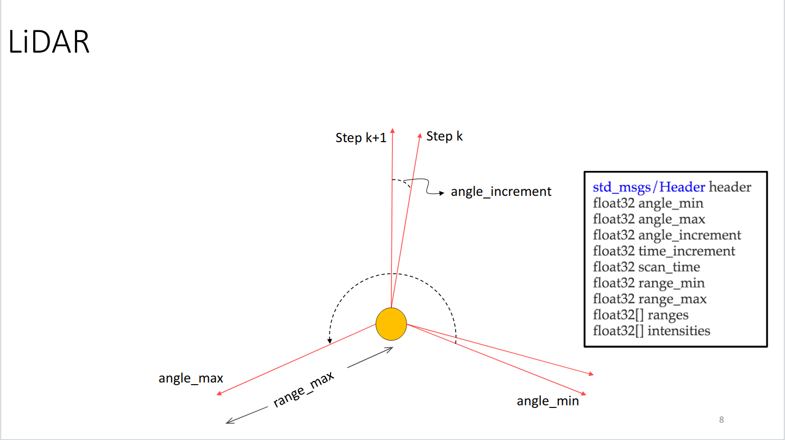
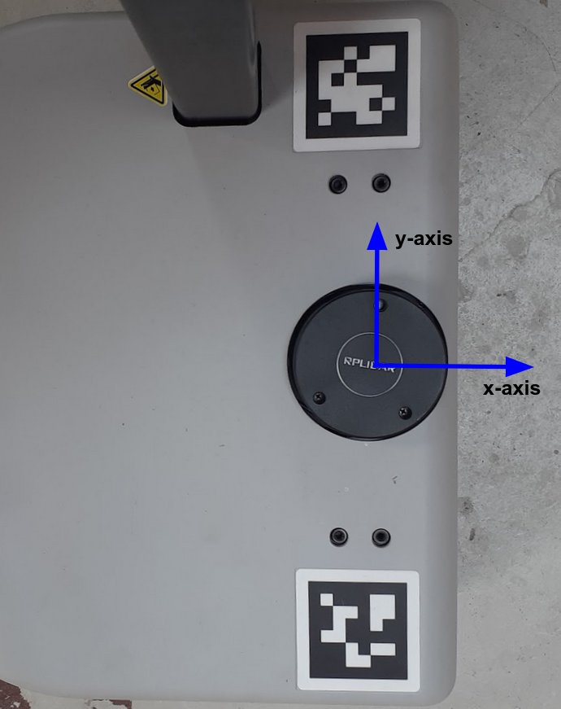
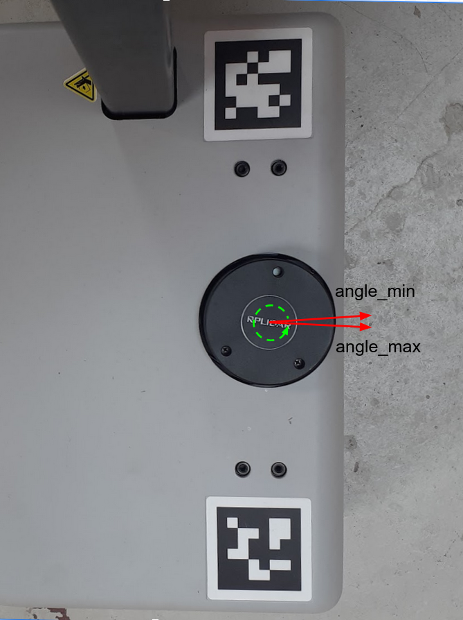
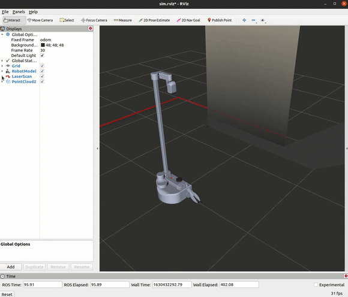

## Example 2

The aim of this example is to provide instruction on how to filter scan messages.

<!-- TODO: Update the links -->
For robots with laser scanners, ROS provides a special Message type in the [sensor_msgs](http://wiki.ros.org/sensor_msgs) package called [LaserScan](http://docs.ros.org/en/api/sensor_msgs/html/msg/LaserScan.html) to hold information about a given scan. Let's take a look at the message specification itself:

```
#
# Laser scans angles are measured counter clockwise,
# with Stretch's LiDAR having both angle_min and angle_max facing forward
# (very closely along the x-axis) of the device frame
#
Header header
float32 angle_min        # start angle of the scan [rad]
float32 angle_max        # end angle of the scan [rad]
float32 angle_increment  # angular distance between measurements [rad]
float32 time_increment   # time between measurements [seconds]
float32 scan_time        # time between scans [seconds]
float32 range_min        # minimum range value [m]
float32 range_max        # maximum range value [m]
float32[] ranges         # range data [m] (Note: values < range_min or > range_max should be discarded)
float32[] intensities    # intensity data [device-specific units]
```
The above message tells you everything you need to know about a scan. Most importantly, you have the angle of each hit and its distance (range) from the scanner. If you want to work with raw range data, then the above message is all you need. There is also an image below that illustrates the components of the message type.

<p align="center">
  
</p>

For a Stretch robot the start angle of the scan, `angle_min`, and
end angle, `angle_max`, are closely located along the x-axis of Stretch's frame. `angle_min` and `angle_max` are set at **-3.1416** and **3.1416**, respectively. This is illustrated by the images below.

<p align="center">
  
  

</p>


Knowing the orientation of the LiDAR allows us to filter the scan values for a desired range. In this case, we are only considering the scan ranges in front of the stretch robot.

First, open a terminal and run the stretch driver launch file.

```bash
ros2 launch stretch_core stretch_driver.launch.py
```

Then in a new terminal run the rplidar launch file from `stretch_core`.
```bash
ros2 launch stretch_core rplidar.launch.py
```

To filter the lidar scans for ranges that are directly in front of Stretch (width of 1 meter) run the scan filter node by typing the following in a new terminal.

```bash
ros2 run stretch_ros_tutorials scan_filter
```

Then run the following command to bring up a simple RViz configuration of the Stretch robot.
```bash
ros2 run rviz2 rviz2 -d `ros2 pkg prefix stretch_calibration`/rviz/stretch_simple_test.rviz
```
Change the topic name from the LaserScan display from */scan* to */filter_scan*.

<p align="center">
  
</p>

### The Code

```python
#!/usr/bin/env python3
import rclpy
from rclpy.node import Node
from numpy import linspace, inf
from math import sin
from sensor_msgs.msg import LaserScan
class ScanFilter(Node):
	def __init__(self):
		super().__init__('stretch_scan_filter')
		self.pub = self.create_publisher(LaserScan, '/filtered_scan', 10)
		self.sub = self.create_subscription(LaserScan, '/scan', self.scan_filter_callback, 10)
		
		self.width = 1
		self.extent = self.width / 2.0
		self.get_logger().info("Publishing the filtered_scan topic. Use RViz to visualize.")
	def scan_filter_callback(self,msg):
		angles = linspace(msg.angle_min, msg.angle_max, len(msg.ranges))
		points = [r * sin(theta) if (theta < -2.5 or theta > 2.5) else inf for r,theta in zip(msg.ranges, angles)]
		new_ranges = [r if abs(y) < self.extent else inf for r,y in zip(msg.ranges, points)]
		msg.ranges = new_ranges
		self.pub.publish(msg)
def main(args=None):
	rclpy.init(args=args)
	scan_filter = ScanFilter()
	rclpy.spin(scan_filter)
	scan_filter.destroy_node()
	rclpy.shutdown()
if __name__ == '__main__':
	main()
```

### The Code Explained

Now let's break the code down.

```python
#!/usr/bin/env python3
```
Every Python ROS [Node](http://wiki.ros.org/Nodes) will have this declaration at the top. The first line makes sure your script is executed as a Python script.


```python
import rclpy
from rclpy.node import Node
from numpy import linspace, inf
from math import sin
from sensor_msgs.msg import LaserScan
```
You need to import rclpy if you are writing a ROS Node. There are functions from numpy and math that are required within this code, that's why linspace, inf, and sin are imported. The sensor_msgs.msg import is so that we can subscribe and publish LaserScan messages.

```python
self.width = 1
self.extent = self.width / 2.0
```
We're going to assume that the robot is pointing up the x-axis, so that any points with y coordinates further than half of the defined width (1 meter) from the axis are not considered.

```python
self.sub = self.create_subscription(LaserScan, '/scan', self.scan_filter_callback, 10)
```
Set up a subscriber.  We're going to subscribe to the topic "/scan", looking for LaserScan messages.  When a message comes in, ROS is going to pass it to the function "callback" automatically.

```python
self.pub = self.create_publisher(LaserScan, '/filtered_scan', 10)
```
This declares that your node is publishing to the *filtered_scan* topic using the message type LaserScan. This lets any nodes listening on *filtered_scan* that we are going to publish data on that topic.

```python
angles = linspace(msg.angle_min, msg.angle_max, len(msg.ranges))
```
This line of code utilizes linspace to compute each angle of the subscribed scan.

```python
points = [r * sin(theta) if (theta < -2.5 or theta > 2.5) else inf for r,theta in zip(msg.ranges, angles)]
```
Here we are computing the y coordinates of the ranges that are **below -2.5** and **above 2.5** radians of the scan angles. These limits are sufficient for considering scan ranges in front of Stretch, but these values can be altered to your preference.

```python
new_ranges = [r if abs(y) < self.extent else inf for r,y in zip(msg.ranges, points)]
```
If the absolute value of a point's y-coordinate is under *self.extent* then keep the range, otherwise use inf, which means "no return".


```python
msg.ranges = new_ranges
self.pub.publish(msg)
```
Substitute in the new ranges in the original message, and republish it.

```python
def main(args=None):
	rclpy.init(args=args)
	scan_filter = ScanFilter()
```
The next line, rclpy.init_node initializes the node. In this case, your node will take on the name 'stretch_scan_filter'. NOTE: the name must be a base name, i.e. it cannot contain any slashes "/".

Setup Scanfilter class with `scan_filter = Scanfilter()`

```python
rclpy.spin(scan_filter)
```
Give control to ROS.  This will allow the callback to be called whenever new
messages come in.  If we don't put this line in, then the node will not work,
and ROS will not process any messages.

**Next Example:** [Example 3](example_3.md)
