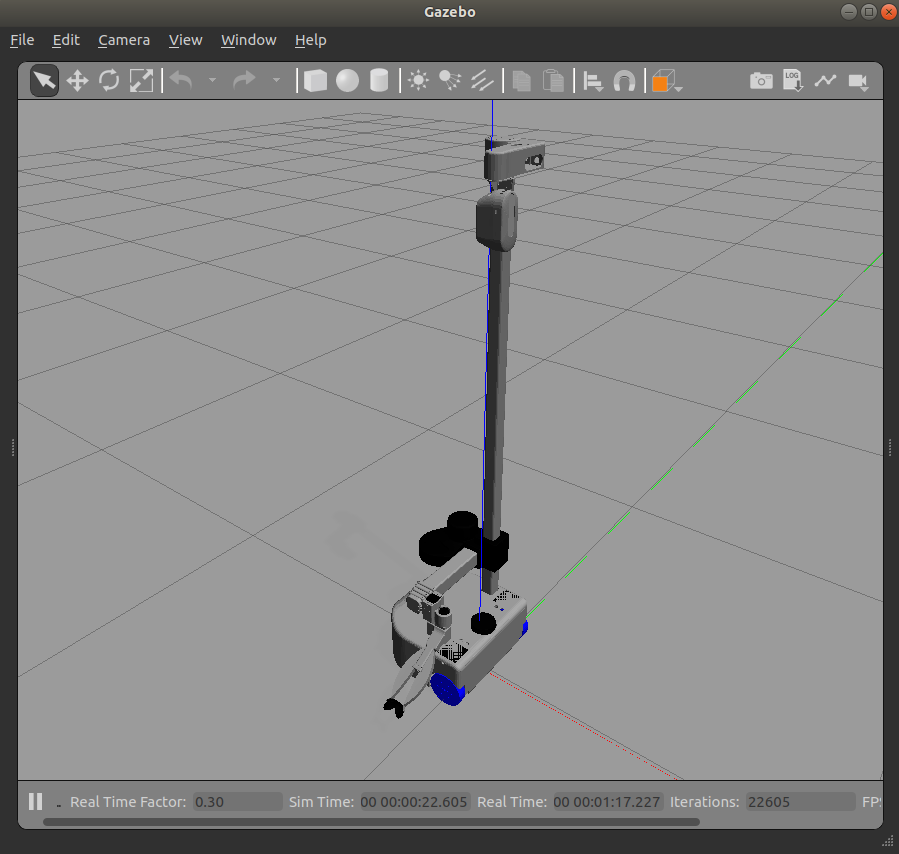

# Spawning Stretch in Simulation (Gazebo)

**NOTE**: ROS 2 tutorials are still under active development. 

### NOTE
Simulation support for Stretch in ROS 2 is under active development. Please reach out to us if you want to work with Stretch in a simulated environment like Gazebo/Ignition in ROS 2.

Refer to the instructions below if you want to test this functionality in ROS 1.

### Empty World Simulation
To spawn the Stretch in gazebo's default empty world run the following command in your terminal.
```
roslaunch stretch_gazebo gazebo.launch
```
This will bringup the robot in the gazebo simulation similar to the image shown below.

<!--  -->


### Custom World Simulation
In gazebo, you are able to spawn Stretch in various worlds. First, source the gazebo world files by running the following command in a terminal
```
echo "source /usr/share/gazebo/setup.sh"
```


Then using the world argument, you can spawn the stretch in the willowgarage world by running the following

```
roslaunch stretch_gazebo gazebo.launch world:=worlds/willowgarage.world
```


**Next Tutorial:** [Teleoperating Stretch](teleoperating_stretch.md)
