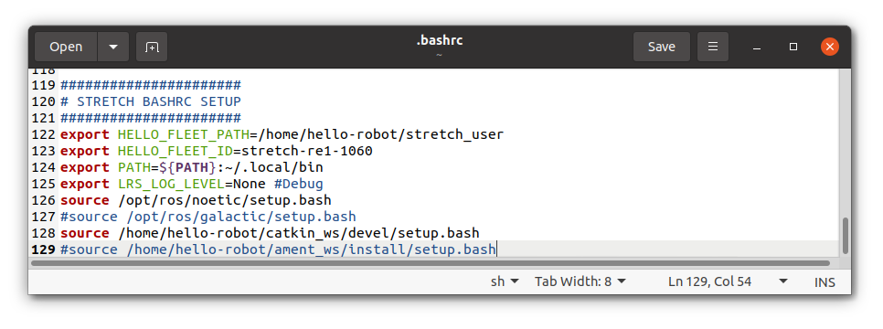
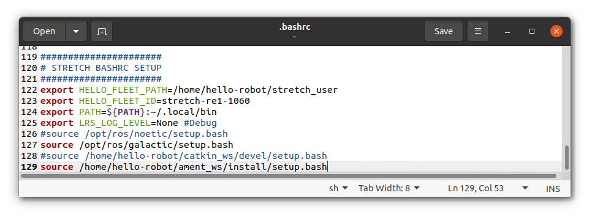

# Getting Started

**NOTE**: ROS 2 tutorials are still under active development. 

## Prerequisites
1. A Stretch RE1 or RE2 robot, turned on and connected to a keyboard, mouse, and monitor
    - Alternatively, setup [untethered operation](https://docs.hello-robot.com/0.2/stretch-tutorials/getting_started/untethered_operation/). This avoids the HDMI/USB cables getting pulled while the robot is moving.
2. Running the Ubuntu 20.04 software stack
    - All RE2s ship with Ubuntu 20.04, however RE1s had shipped with Ubuntu 18.04 until summer 2022. RE1 users should run `lsb_release -sd` in a terminal and confirm "Ubuntu 20.04.5 LTS" or similar is printed out. If you are running Ubuntu 18.04, follow the [upgrade guide](https://docs.hello-robot.com/0.2/stretch-install/docs/robot_install/).
3. Already went through the [Start Coding section of the Getting Started guide](../getting_started/quick_start_guide_re2.md#start-coding) (hello_robot_xbox_teleop must not be running in the background)

## Switching to ROS2

It's recommended that ROS1 and ROS2 systems not run at the same time. Therefore, the default installation starts with ROS1 enabled and ROS2 disabled. This is configured in the "STRETCH BASHRC SETUP", which you can see by running `gedit ~/.bashrc` in a terminal and scrolling to the bottom.



We will disable ROS1 by commenting out the ROS1 related lines by adding '#' in front of them, and enable ROS2 by uncommenting the ROS2 related lines by deleting the '#' in front of them. The result will look like:



Save this configuration using **Ctrl + S**. Close out of the current terminal and open a new one. ROS2 is now enabled!

## Refreshing the ROS2 workspace

While Stretch ROS2 is in beta, there will be frequent updates to the ROS2 software. Therefore, it makes sense to refresh the ROS2 software to the latest available release. In the ROS and ROS2 world, software is organized into "ROS Workspaces", where packages can be developed, compiled, and be made available to run from the command line. We are going to refresh the ROS2 workspace, which is called "~/ament_ws" and available in the home directory. Follow the [Create a new ROS Workspace guide](https://docs.hello-robot.com/0.2/stretch-install/docs/ros_workspace/) to run the `stretch_create_ament_workspace.sh` script. This will delete the existing "~/ament_ws", create a new one with all of the required ROS2 packages for Stretch, and compile it.

## Testing Keyboard Teleop

We can test whether the ROS2 workspace was enabled successfully by testing out the ROS2 drivers package, called "stretch_core", with keyboard teleop. In one terminal, we'll launch Stretch's ROS2 drivers using:

```bash
ros2 launch stretch_core stretch_driver.launch.py mode:=manipulation
```

In the second terminal, launch the keyboard teleop node using:
```bash
ros2 run stretch_core keyboard_teleop
```

The following menu will be outputted to the terminal and you can press a key to move the corresponding joint on the robot. When you're ready to exit, press **Ctrl + C**.

```
[INFO] [1672878953.011453154] [keyboard_teleop]: keyboard_teleop started
[INFO] [1672878953.041154084] [keyboard_teleop]: Node keyboard_teleop connected to /stop_the_robot service.
---------- KEYBOARD TELEOP MENU -----------
                                           
              i HEAD UP                    
 j HEAD LEFT            l HEAD RIGHT       
              , HEAD DOWN                  
                                           
                                           
 7 BASE ROTATE LEFT     9 BASE ROTATE RIGHT
 home                   page-up            
                                           
                                           
              8 LIFT UP                    
              up-arrow                     
 4 BASE FORWARD         6 BASE BACK        
 left-arrow             right-arrow        
              2 LIFT DOWN                  
              down-arrow                   
                                           
                                           
              w ARM OUT                    
 a WRIST FORWARD        d WRIST BACK       
              x ARM IN                     
                                           
                                           
              5 GRIPPER CLOSE              
              0 GRIPPER OPEN               
                                           
  step size:  b BIG, m MEDIUM, s SMALL     
                                           
              q QUIT                       
                                           
-------------------------------------------
```

ROS2 is setup! Move onto the next tutorial: [Follow Joint Trajectory Commands](follow_joint_trajectory.md).
