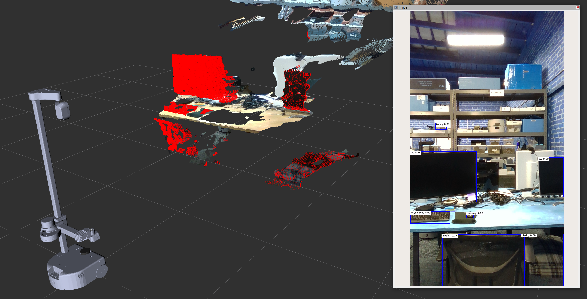
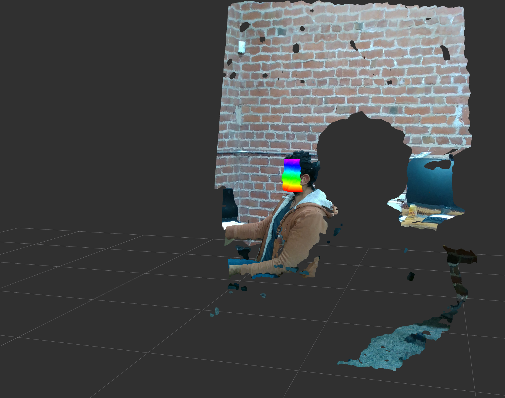

# Offloading Heavy Robot Compute to Remote Workstation 
In this tutorial, we will explore the method for offloading computationally intensive processes, such as running computer vision models, to a remote workstation computer. This approach offers several advantages such as:
- Saving robot's processing power.
- Increasing robot's efficiency by offloading high-power consuming processes. 
- Utilizing available GPU hardware on powerful workstations to run large deep learning models.

We will delve into the process of **offloading [Stretch Deep Perception](https://github.com/hello-robot/stretch_ros2/tree/humble/stretch_deep_perception) ROS 2 nodes**. These nodes are known for their demanding computational requirements and are frequently used in [Stretch Demos](https://github.com/hello-robot/stretch_ros2/tree/humble/stretch_demos). 

*NOTE: All Stretch ROS 2 packages are developed with Humble distro.*

## 1. Setting a ROS_DOMAIN_ID

ROS 2 utilizes [DDS](https://design.ros2.org/articles/ros_on_dds.html) as the default middleware for communication. **DDS enables nodes within the same physical network to seamlessly discover one another and establish communication, provided they share the same [ROS_DOMAIN_ID](https://docs.ros.org/en/humble/Concepts/Intermediate/About-Domain-ID.html)**. This powerful mechanism ensures secure message passing between remote nodes as intended.

By default, all ROS 2 nodes are configured with domain ID 0. To avoid conflicts, select a domain ID from the range of 0 to 101, and then set this chosen domain ID as the value for the `ROS_DOMAIN_ID` environment variable in both the Workstation and the Robot.
```{.bash .shell-prompt}
export ROS_DOMAIN_ID=<ID>
```

## 2. Setup the Workstation to work with Stretch
The workstation needs to be installed with the stretch related ROS 2 packages to have access to robot meshes for Visualization in Rviz, custom interfaces dependencies and essential perception packages.

This section assumes the workstation already has an active ROS 2 distro and colcon dependencies pre-installed.
You can find [ROS 2 Installation step for Ubuntu here](https://docs.ros.org/en/humble/Installation/Alternatives/Ubuntu-Install-Binary.html#).


#### Setup Essential stretch_ros2 Packages 

Make sure the ROS 2 distro is sourced.
```{.bash .shell-prompt}
source /opt/ros/humble/setup.bash
```

Create workspace directory and clone stretch_ros2 packages along with it's dependency packages to `src` folder.
```{.bash .shell-prompt}
mkdir -p ~/ament_ws/src
cd ~/ament_ws/src/
git clone https://github.com/hello-robot/stretch_ros2
git clone https://github.com/hello-binit/ros2_numpy -b humble
git clone https://github.com/IntelRealSense/realsense-ros.git -b ros2-development
git clone https://github.com/Slamtec/sllidar_ros2.git -b main
git clone https://github.com/hello-binit/respeaker_ros2.git -b humble
git clone https://github.com/hello-binit/audio_common.git -b humble
```

Build and install all the packages present in source folder. 
```{.bash .shell-prompt}
cd ~/ament_ws
rosdep install --rosdistro=humble -iyr --skip-keys="librealsense2" --from-paths src
colcon build --cmake-args -DCMAKE_BUILD_TYPE=Release
```

Make sure to source the workspace to discover the packages in it.
```{.bash .shell-prompt}
source ~/ament_ws/install/setup.bash
```

#### Setup Robot URDF and Meshes
All the robots will have calibrated URDF with pre-configured mesh files in the stretch_description package directory that is specific to your actual robot. So we recommend you to **copy the `stretch_description` directory that exists inside your robot and replace it with the one existing in the workstation**. The Stretch Description directory exists in the path `~/ament_ws/src/stretch_ros2/stretch_description`.

If you dont want to use the URDFs from the robot, you can manually generate the uncalibrated URDF w.r.t your robot configuration using the following commands:
```{.bash .shell-prompt}
cd ~/ament_ws/src/stretch_ros2/stretch_description/urdf/

#if Dex-Wrist Installed
cp stretch_description_dex.xacro stretch_description.xacro

#if Standard Gripper
cp stretch_description_standard.xacro stretch_description.xacro

ros2 run stretch_calibration update_uncalibrated_urdf
cp stretch_uncalibrated.urdf stretch.urdf
```

After setting up the stretch_description folder, re-build the workspace to update the package with latest changes.
```{.bash .shell-prompt}
cd ~/ament_ws
colcon build
```

#### Download Stretch Deep Perception Models
[stretch_deep_perception_models](https://github.com/hello-robot/stretch_deep_perception_models) provides open deep learning models from third parties for use. We are cloning this directory to the home folder in the workstation.
```{.bash .shell-prompt}
cd ~/ 
git clone https://github.com/hello-robot/stretch_deep_perception_models
```


## 3. Start core Nodes on the Robot Compute 
Start the core driver nodes for controlling the robot, streaming the Lidar and realsense depth camera/s data using the [stretch_core](https://github.com/hello-robot/stretch_ros2/tree/humble/stretch_core) package.


```{.bash .shell-prompt}
# Terminal 1: Start the Stretch Driver Node
ros2 launch stretch_core stretch_driver.launch.py
# Terminal 2: Start the realsense D435i stream.
ros2 launch stretch_core d435i_high_resolution.launch.py
# Terminal 3: Start lidar.
ros2 launch stretch_core rplidar.launch.py
```

## 4. Verify Remote Workstation is able to discover Stretch Nodes
After launching the above core nodes, all the robot control interfaces and sensor data streams should be exposed to all the other nodes in the same physical network with common ROS_DOMAIN_ID set.

From the remote workstation try the following test commands:
```{.bash .shell-prompt}
# Check if all robot topics are visible.
ros2 topic list

# Check if able to receive a sensor data by printing from Joint States topic.
ros2 topic echo /joint_states

# Check if able to send commands to robot by triggering stow_the_robot service
ros2 service call /stow_the_robot std_srvs/srv/Trigger
```


## 5. Offload Object Detection Node to Remote Workstation

From the workstation, run the [object detection node](https://github.com/hello-robot/stretch_ros2/blob/humble/stretch_deep_perception/stretch_deep_perception/detect_objects.py) which runs a YoloV5 model.
```{.bash .shell-prompt}
ros2 run stretch_deep_perception detect_objects
```
The node would start printing out the detected objects.
```{.bash .shell-prompt}
Fusing layers... 
YOLOv5s summary: 213 layers, 7225885 parameters, 0 gradients
Adding AutoShape... 
[INFO] [1698379209.925727618] [DetectObjectsNode]: DetectObjectsNode started
tv  detected
keyboard  detected
chair  detected
mouse  detected
mouse  detected
tv  detected
keyboard  detected
chair  detected
mouse  detected
mouse  detected
bowl  detected
tv  detected
keyboard  detected
chair  detected
mouse  detected
mouse  detected
```

##### Visualize in Rviz
```{.bash .shell-prompt}
rviz2 -d ~/ament_ws/install/stretch_deep_perception/share/stretch_deep_perception/rviz/object_detection.rviz
```



## 6. Offload Face  detection Node to Remote Workstation
From the workstation, run the [face detection node](https://github.com/hello-robot/stretch_ros2/blob/humble/stretch_deep_perception/stretch_deep_perception/detect_faces.py). The face-detection node uses model parameters loaded from the stretch_deep_perception_models directory, whose [path is pulled](https://github.com/hello-robot/stretch_ros2/blob/humble/stretch_deep_perception/stretch_deep_perception/deep_learning_model_options.py#L5) from HELLO_FLEET_PATH environment variable. In our case, we will set the HELLO_FLEET_PATH environment variable to point to the home folder where the stretch_deep_perception_models directory was cloned.
```{.bash .shell-prompt}
export HELLO_FLEET_PATH=~/
ros2 run stretch_deep_perception detect_faces
```
The node will load the face detection model network and start poblishing the detection.
```
head_detection_model.getUnconnectedOutLayers() = [112]
head_detection_model output layer names = ['detection_out']
head_detection_model output layer names = ('detection_out',)
head_detection_model input layer = <dnn_Layer 0x7f7d1e695cd0>
.
.
.
landmarks_model input layer name = align_fc3
landmarks_model out_layer = <dnn_Layer 0x7f7d1e695d30>
[INFO] [1698383830.671699923] [DetectFacesNode]: DetectFacesNode started
```

##### Visualize in Rviz
```{.bash .shell-prompt}
rviz2 -d ~/ament_ws/install/stretch_deep_perception/share/stretch_deep_perception/rviz/face_detection.rviz
```



### Troubleshooting Notes
- Using a dedicated Wi-Fi router would increase the data transmission speeds significantly.
- Realtime PointCloud visualization in Rviz commonly lags because of subscribing to a large message data stream. We recommend turning off the point-cloud visualization in remote workstations when possible to decrease network overhead.
- If the nodes in the remote network are unable to discover robot running nodes, here are two debug steps:
  - Check if you can ping between the robot and remote workstation computer.
  - Use `ifconfig` command and compare the Network assigned IP addresses of both the robot and workstation. The first two parts of the IP address should normally match for both computers to discover each other in the network.


