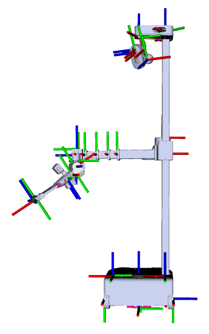
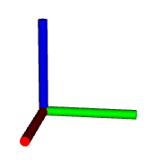
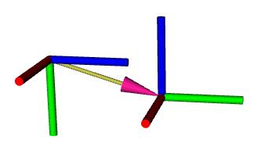

# The Transform Tree

The many 3D coordinate frames on Stretch are managed by a piece of software called "tf2" (TransForm version 2). In this tutorial, we'll cover what "transformation frames" are, where they are placed on Stretch, and how to work with them using the TF2 library.

{ loading=lazy }

When working with a robot, we'd like to know where each part of the robot is in 3D space. Mathematically, the coordinate transformation system allows us to precisely describe where everything is located.

## Background

A great introduction on this subject can be found in chapter 2 of John J. Craig's textbook, Introduction to Robotics: Mechanics and Control. But in brief, a 3D coordinate frame is composed of 3 axes, orthogonal to one another according to the right-hand coordinate frame convention.

{ loading=lazy }

!!! note

    The X, Y, and Z axes are colored red, green, and blue respectively. An easy way to remember this is to map XYZ -> RGB

A "transformation" or transform describes the position and orientation of a coordinate frame with respect to another coordinate frame.

{ loading=lazy }

Position and orientation can be described by 6 numbers: x, y, and z for position and roll, pitch, and yaw for orientation (more commonly, you'll see orientation described as a quaternion which is 4 numbers). Another term for a position + orientation combo is "pose". If we know the pose of an object in one coordinate frame, and we know the transform between this frame to another, then we can find the pose of the object with respect the latter frame. If we continue describing frames with respect to previous ones, we'll have built up a chain of transforms. Similarly, we can build up transform trees, and even transform graphs with cyclic connections.

