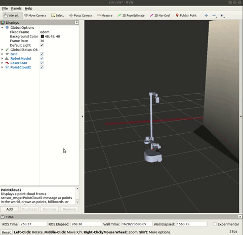

## Visualizing with RViz

Let's bringup stretch in the willowgarage world from the [gazebo basics tutorial](gazebo_basics.md) and RViz by using the following command.

```
roslaunch stretch_gazebo stretch_willowgarage_world.launch rviz:=true
```
the `rviz` flag will open an RViz window  to visualize a variety of ROS topics.


If you want the visualize the tf transform tree, you can add this to the your display.


Further tutorials for RViz can be found [here](http://wiki.ros.org/rviz/Tutorials).
