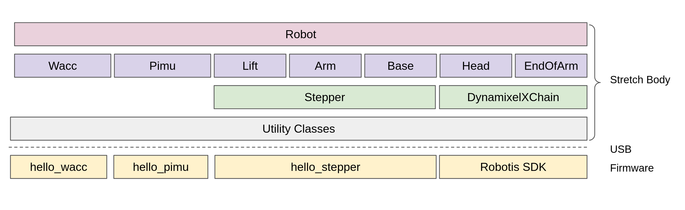

# Tutorial: Introduction to Stretch Body
The Stretch_Body package provides a low-level Python API to the Stretch hardware.  The Stretch_Body package is intended for advanced users who prefer to not use ROS to control the robot. It assumes a moderate level of experience programming robot sensors and actuators.

The package is available on [Git and installable via Pip](https://github.com/hello-robot/stretch_body).

It encapsulates the:

* Mobile base 
* Arm 
* Lift 
* Head actuators
* End-of-arm-actuators
* Wrist board with accelerometer (Wacc)
* Base power and IMU board (Pimu)

As shown below, the primary programming interface to Stretch Body is the [Robot class](https://github.com/hello-robot/stretch_body/blob/master/body/stretch_body/robot.py). This class encapsulates the various hardware module classes  (e.g. Lift, Arm, etc). Each of these modules then communicates with the robot firmware over USB using various utility classes.



Stretch also includes 3rd party hardware devices that are not accessible through Stretch_Body. However, it is possible to directly access this hardware through open-source Python packages:

* Laser range finder:  [rplidar](https://github.com/SkoltechRobotics/rplidar)
* Respeaker: [respeaker_python_library](https://github.com/respeaker/respeaker_python_library)
* D435i: [pyrealsense2](https://pypi.org/project/pyrealsense2/)


## Robot Interface

The primary developer interface to  Stretch_Body is the [Robot class](https://github.com/hello-robot/stretch_body/blob/master/body/stretch_body/robot.py).  Let's write some code to explore the interface. Launch an interactive Python terminal:

```{.bash .shell-prompt}
ipython
```

Then type in the following:

```python linenums="1"
import time
import stretch_body.robot

robot=stretch_body.robot.Robot()
robot.startup()

for i in range(10):
	robot.pretty_print()
	time.sleep(0.25)
	
robot.stop()

```

As you can see, this prints all robot sensors and state data to the console every 250ms. 


Looking at this in detail:

```python linenums="4"
import stretch_body.robot
robot=stretch_body.robot.Robot()
robot.startup()
```

Here we instantiated an instance of our robot through the Robot class. The call to `startup()` opens the serial ports to the various devices, loads the robot YAML parameters, and launches a few helper threads.

```python linenums="7"
for i in range(10):
	robot.pretty_print()
	time.sleep(0.25)
```

The call to `pretty_print()` prints to console all of the robot's sensor and state data. The sensor data is automatically updated in the background by a helper thread.

```python linenums="11"
robot.stop()
```

Finally, the `stop()` method shuts down the threads and cleanly closes the open serial ports.

### Units

The Robot API uses SI units:

* meters
* radians
* seconds
* Newtons
* Amps
* Volts

Parameters may be named with a suffix to help describe the unit type. For example:

* pos_m : meters
* pos_r: radians

### The Robot Status

The Robot derives from the [Device class](https://github.com/hello-robot/stretch_body/blob/master/body/stretch_body/device.py). It also encapsulates several other Devices:

* [robot.head](https://github.com/hello-robot/stretch_body/blob/master/body/stretch_body/head.py)
* [robot.arm](https://github.com/hello-robot/stretch_body/blob/master/body/stretch_body/arm.py)
* [robot.lift](https://github.com/hello-robot/stretch_body/blob/master/body/stretch_body/lift.py)
* [robot.base](https://github.com/hello-robot/stretch_body/blob/master/body/stretch_body/base.py)
* [robot.wacc](https://github.com/hello-robot/stretch_body/blob/master/body/stretch_body/wacc.py)
* [robot.pimu](https://github.com/hello-robot/stretch_body/blob/master/body/stretch_body/pimu.py)
* [robot.end_of_arm](https://github.com/hello-robot/stretch_body/blob/master/body/stretch_body/end_of_arm.py)

All devices contain a Status dictionary. The Status contains the most recent sensor and state data of that device. For example, looking at the Arm class we see:

```python
class Arm(Device):
    def __init__(self):
        ...
		self.status = {'pos': 0.0, 'vel': 0.0, 'force':0.0, \
                       'motor':self.motor.status,'timestamp_pc':0}
```

The Status dictionaries are automatically updated by a background thread of the Robot class at around 25Hz. The Status data can be accessed via the Robot class as below:

```python
if robot.arm.status['pos']>0.25:
    print('Arm extension greater than 0.25m')
```

If an instantaneous snapshot of the entire Robot Status is needed, the `get_status()` method can be used instead:

```python
status=robot.get_status()
```

### The Robot Command

In contrast to the Robot Status which pulls data from the Devices, the Robot Command pushes data to the Devices.

Consider the following example which extends and then retracts the arm by 0.1 meters:

```python linenums="1"
import time
import stretch_body.robot

robot=stretch_body.robot.Robot()
robot.startup()

robot.arm.move_by(0.1)
robot.push_command()
time.sleep(2.0) 

robot.arm.move_by(-0.1)
robot.push_command()
time.sleep(2.0)
	
robot.stop()
```

A few important things are going on:

```python linenums="7"
robot.arm.move_by(0.1)
```

The `move_by()` method queues up the command to the stepper motor controller. However, the command does not yet execute.

```python linenums="8"
robot.push_command()
```

The `push_command()` causes all queued-up commands to be executed at once. This allows for the synchronization of motion across joints. For example, the following code will cause the base, arm, and lift to initiate motion simultaneously:

```python linenums="1"
import time
import stretch_body.robot

robot=stretch_body.robot.Robot()
robot.startup()

robot.arm.move_by(0.1)
robot.lift.move_by(0.1)
robot.base.translate_by(0.1)
robot.push_command()
time.sleep(2.0)
	
robot.stop()
```

!!! note
	In this example we call `sleep()` to allow time for the motion to complete before initiating a new motion.

!!! note
	The Dynamixel servos do not use the Hello Robot communication protocol. As such, the head, wrist, and gripper will move immediately upon issuing a motion command. 

------
<div align="center"> All materials are Copyright 2022 by Hello Robot Inc. Hello Robot and Stretch are registered trademarks.</div>