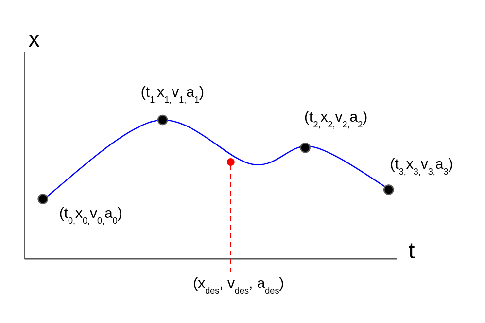
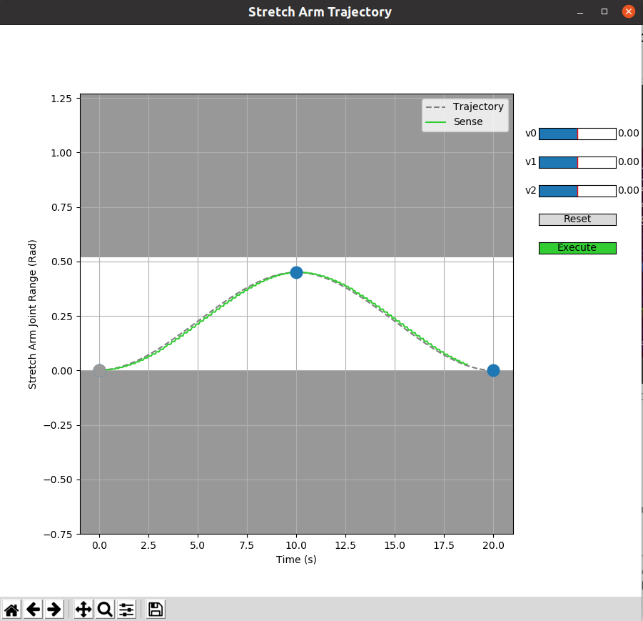
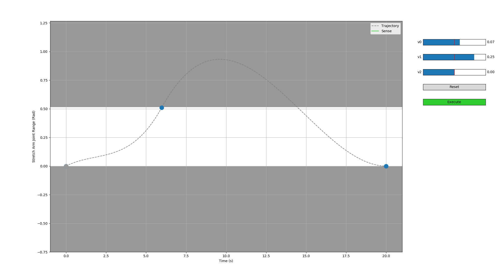

# Tutorial: Splined Trajectories

Stretch Body supports splined trajectory controllers across all of its joints. This enables Stretch to achieve smooth and coordinated full-body control of the robot. 

## What are Splined Trajectories?

A splined trajectory is a smooth path that a robot joint follows over a specific period of time. [Cubic or quintic splines](https://en.wikipedia.org/wiki/Spline_(mathematics)) are used to represent the trajectory. As shown below, the splines (blue) are defined by a series of user provided waypoints (black dot). A waypoint is simply a target position, velocity, and optional acceleration at a given time. The spline ensures continuity and smoothness when interpolating between the waypoint targets.

During execution, the trajectory controller uses this splined representation to compute the instantaneous desired position, velocity, and acceleration of the joint (red). On Stretch, this instantaneous target is then passed to a lower-level position or velocity controller. 

Splined trajectories are particularly useful when you want to coordinate motion across several joints. Because the trajectory representation is time based, it is straightforward to encode multi-joint coordination. Stretch Body supports both cubic and quintic spline. A quintic spline waypoint includes acceleration in the waypoint target, while a cubic spline does not. 




## The Splined Trajectory Tool

Stretch Body includes [a graphical tool for exploring splined trajectory control](https://github.com/hello-robot/stretch_body/blob/master/tools/bin/stretch_trajectory_jog.py) on the robot:

```bash
stretch_trajectory_jog.py -h
usage: stretch_trajectory_jog.py [-h] [--text] [--preloaded_traj {1,2,3}] (--head_pan | --head_tilt | --wrist_yaw | --gripper | --arm | --lift | --base_translate | --base_rotate | --full_body)

Test out splined trajectories on the various joint from a GUI or text menu.

optional arguments:
  -h, --help            show this help message and exit
  --text, -t            Use text options instead of GUI
  --preloaded_traj {1,2,3}, -p {1,2,3}
                        Load one of three predefined trajectories
  --head_pan            Test trajectories on the head_pan joint
  --head_tilt           Test trajectories on the head_tilt joint
  --wrist_yaw           Test trajectories on the wrist_yaw joint
  --gripper             Test trajectories on the stretch_gripper joint
  --arm                 Test trajectories on the arm joint
  --lift                Test trajectories on the lift joint
  --base_translate      Test translational trajectories on diff-drive base
  --base_rotate         Test rotational trajectories on diff-drive base
  --full_body           Test trajectories on all joints at once

```

The tool GUI allows you to interactively construct a splined trajectory and then execute it on the robot. For example, on the arm:



**NOTE**: Use caution when commanding the base. Ensure that attached cables are long enough to support base motion. Alternatively you may want to put the base on top of a book so the wheel don't touch the ground.

Finally, you can explore a full-body trajectory using the non-GUI version of the tool:

```bash
>>$ stretch_trajectory_jog.py --full_body
```


## Programming Trajectories

Programming a splined trajectory is straightforward. Try the following from iPython:

```python
import stretch_body.robot
r=stretch_body.robot.Robot()
r.startup()

#Define the waypoints
times = [0.0, 10.0, 20.0]
positions = [r.arm.status['pos'], 0.45, 0.0]
velocities = [r.arm.status['vel'], 0.0, 0.0]

#Create the spline trajectory
for waypoint in zip(times, positions, velocities):
    r.arm.trajectory.add(waypoint[0], waypoint[1], waypoint[2])

#Begin execution
r.arm.follow_trajectory()

#Wait unti completion
while r.arm.is_trajectory_active():
	print('Execution time: %f'%r.arm.get_trajectory_time_remaining())
    time.sleep(0.1)

r.stop()
```

This will cause the arm to move from its current position to 0.45m, then back to fully retracted. A few things to note:

* This will execute a Cubic spline as we did not pass in accelerations to in `r.arm.trajectory.add`
* The call to `r.arm.follow_trajectory` is non-blocking and the trajectory generation is handled by a background thread of the Robot class

If you're interested in exploring the trajectory API further the [code for the `stretch_trajectory_jog.py`](https://github.com/hello-robot/stretch_body/blob/master/tools/bin/stretch_trajectory_jog.py)is a great reference to get started.

## Advanced: Controller Parameters

Sometimes the robot motion isn't quite what is expected when executing a splined trajectories. It is important that the trajectory be well-formed, meaning that it:

* Respects the maximum velocity and accelerations limits of the joint
* Doesn't create a large 'excursion' outside of the acceptable range of motion in order to hit a target waypoint
* Doesn't have waypoints so closely spaced together that it exceeds the nominal control rates of Stretch (~10-20 Hz)

For example, the arm trajectory below has a large excursion outside of the joints range of motion (white). This is because the second waypoint expects a non-zero velocity when the arm reaches full extension. 




Often the trajectory waypoints will be generated from a motion planner. It is important that this planner incorporates the position, velocity, and acceleration constraints of the joint. These can be found by, for example

```bash
>>$ stretch_params.py | grep arm | grep motion | grep trajectory
stretch_body.robot_params.nominal_params  param.arm.motion.trajectory_max.vel_m    0.4             
stretch_body.robot_params.nominal_params param.arm.motion.trajectory_max.accel_m   0.4 

>>$ stretch_params.py | grep arm | grep range_m
stretch_user_params.yaml       param.arm.range_m      [0.0, 0.515] 
```

Fortunately the Stretch Body [Trajectory](https://github.com/hello-robot/stretch_body/blob/master/body/stretch_body/trajectories.py) classes do some preliminary feasibility checking of trajectories using the [is_segment_feasible function](https://github.com/hello-robot/stretch_body/blob/master/body/stretch_body/hello_utils.py#L290). This checks if the generated motions lie within the constraints of the `trajectory_max` parameters.

It is generally important for the waypoints to be spaced far apart. Stretch isn't a dynamic and fast moving robot, so there isn't a practical advantage to closely spaced waypoints at any rate. 

The stepper controllers (arm, lift, and base) can be updated at approximately 20 Hz maximum. Therefore, if your waypoints are spaced 50 ms apart, you run the risk of overflowing the stepper controller. Likewise, the Dynamixel joints can be updated at approximately 12 Hz. As a rule of thumb, spacing the waypoints over 100 ms apart is a good idea.

------
<div align="center"> All materials are Copyright 2022 by Hello Robot Inc. Hello Robot and Stretch are registered trademarks.</div>
