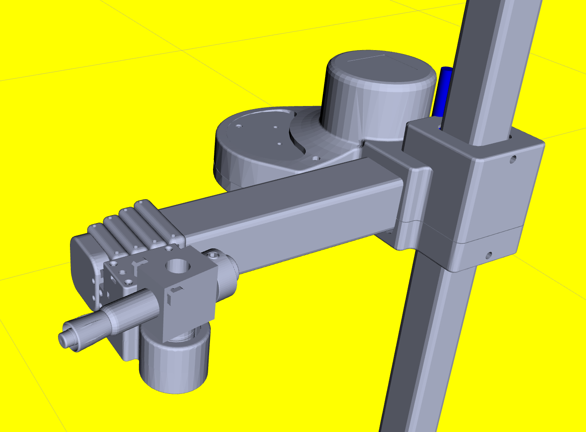

# Tutorial: Tool Change

Many users will want to work with tools other than the default Stretch Gripper that ships with the robot. In this tutorial, you will learn how to configure the Stretch software interfaces to support other tools.

## Changing Tool Interfaces in Stretch Body

Stretch Body supports a plug-in-based architecture for tools. A tool is an extension of the [EndOfArm](https://github.com/hello-robot/stretch_body/blob/master/body/stretch_body/end_of_arm.py) class that supports additional degrees of freedom. 

### Standard Tools

Stretch Body supports two tool interfaces by default: The [ToolNone & ToolStretchGripper](https://github.com/hello-robot/stretch_body/tree/master/body/end_of_arm_tools.py). We will explore swapping between these default tools.

### ToolStretchGripper

Stretch is configured to load the ToolStretchGripper interface by default. This tool is loaded according to the `robot.tool` parameter:

```bash
>>$ stretch_params.py | grep robot.tool
stretch_body.robot_params.nominal_params     param.robot.tool               tool_stretch_gripper
```

We can interact with this tool from iPython

```python
In [1]: import stretch_body.robot as robot

In [2]: r=robot.Robot()

In [3]: r.startup()

In [4]: r.end_of_arm
Out[4]: <stretch_body.end_of_arm_tools.ToolStretchGripper instance at 0x7f99109155a0>

In [5]: r.end_of_arm.motors
Out[5]: 
{'stretch_gripper': <stretch_body.stretch_gripper.StretchGripper instance at 0x7f99109159b0>,
 'wrist_yaw': <stretch_body.wrist_yaw.WristYaw instance at 0x7f9910915820>}

In [6]: r.end_of_arm.stow()
--------- Stowing Wrist Yaw ----
--------- Stowing Gripper ----
In [7]: r.stop()
```

### ToolNone

The ToolNone interface can be loaded when no tool is attached to the Wrist Yaw joint.  To switch to this interface, simply update the field in your `stretch_re1_user_params.yaml` to:

```yaml
robot:
  tool: tool_none
```

After updating the YAML we can interact with the ToolNone via iPython

```python
In [1]: import stretch_body.robot as robot

In [2]: r=robot.Robot()

In [3]: r.startup()

In [4]: r.end_of_arm
Out[4]: <stretch_body.end_of_arm_tools.ToolNone instance at 0x7f245f786fa0>

In [5]: r.end_of_arm.motors
Out[5]: {'wrist_yaw': <stretch_body.wrist_yaw.WristYaw instance at 0x7f245e69e410>}

In [6]: r.end_of_arm.stow()
--------- Stowing Wrist Yaw ----
In [7]: r.stop()
```

## Loading Tool Interfaces from Stretch Tool Share

The [Stretch Tool Share](https://github.com/hello-robot/stretch_tool_share/) is an open Git repository for non-standard Stretch tools. It hosts the CAD, URDF, and Python files needed to integrate these tools with your robot.

To use Stretch Tool Share tools, first update your installation:

```console
$ pip install -U hello-robot-stretch-tool-share
```

As an example, we see on the Tool Share that there is a tool, the [ToolDryEraseToolHolderV1](https://github.com/hello-robot/stretch_tool_share/blob/master/python/stretch_tool_share/dry_erase_holder_v1/tool.py) which [extends the EndOfArm](https://github.com/hello-robot/stretch_tool_share/blob/master/python/stretch_tool_share/usbcam_wrist_v1/tool.py) class. To load this tool interface, modify your `stretch_user_params.yaml` to load the tool as before. We will also need to tell it where to find the tool's [parameter file](https://github.com/hello-robot/stretch_tool_share/blob/master/python/stretch_tool_share/dry_erase_holder_v1/params.py):

```yaml
robot:
  tool: tool_dry_erase_holder_v1
params:
- stretch_tool_share.dry_erase_holder_v1.params
```

We can now interact with the tool in iPython:

```python
In [1]: import stretch_body.robot as robot

In [2]: r=robot.Robot()

In [3]: r.startup()

In [4]: r.end_of_arm
Out[4]: <stretch_tool_share.dry_erase_holder_v1.tool.ToolDryEraseHolderV1 instance at 0x7f3b61c17f00>

In [5]: r.end_of_arm.motors
Out[5]: {'wrist_yaw': <stretch_body.wrist_yaw.WristYaw instance at 0x7f3b61c59280>}

In [6]: r.end_of_arm.stow()
--------- Stowing Wrist Yaw ----

```

# Changing Tool Interfaces in Stretch ROS

Next, we'll see how to change the ROS interface for a tool. Here we will continue with the [ToolDryEraseHolderV1](https://github.com/hello-robot/stretch_tool_share/blob/master/python/stretch_tool_share/dry_erase_holder_v1/tool.py#L3) example.  First, configure Stretch Body to use the tool as in the previous exercise.

Next, ensure ROS is up to date:

```console
$ cd ~/catkin_ws/src/stretch_ros/
$ git pull
```

To access the URDF data for the [ToolDryEraseHolderV1](https://github.com/hello-robot/stretch_tool_share/blob/master/python/stretch_tool_share/dry_erase_holder_v1/tool.py#L3) we'll need to clone the Tool Share repository:

```console
$ cd ~/repos
$ git clone https://github.com/hello-robot/stretch_tool_share
```

Copy the tool's URDF data into the Stretch ROS repository:

```console
$ cd ~/repos/stretch_tool_share/tool_share/dry_erase_holder_v1
$ cp stretch_description/urdf/*.xacro ~/catkin_ws/src/stretch_ros/stretch_description/urdf/
$ cp stretch_description/meshes/*.STL ~/catkin_ws/src/stretch_ros/stretch_description/meshes/
```

Now we will update the tool Xacro for Stretch. Open the file `~/catkin_ws/src/stretch_ros/stretch_description/urdf/stretch_description.xacro` in an editor. Comment out the current tool Xacro and include the Xacro for the dry-erase holder.

```xml
<?xml version="1.0"?>
<robot xmlns:xacro="http://www.ros.org/wiki/xacro" name="stretch_description">

  <!--<xacro:include filename="stretch_gripper.xacro" />-->
  <xacro:include filename="stretch_dry_erase_marker.xacro" />
    
  <xacro:include filename="stretch_main.xacro" />
  <xacro:include filename="stretch_aruco.xacro" />
  <xacro:include filename="stretch_d435i.xacro" />
  <xacro:include filename="stretch_laser_range_finder.xacro" />
  <xacro:include filename="stretch_respeaker.xacro" />
</robot>
```

Finally, we'll update the calibrated URDF to use this new tool:

```console
$ cd ~/catkin_ws/src/stretch_ros/stretch_description/urdf
$ cp stretch.urdf stretch.urdf.bak
$ rosrun stretch_calibration update_urdf_after_xacro_change.sh
```

Press Ctrl-C when the `rosrun` command terminates and you're ready to visualize the tool in RViz:

```console
$ roslaunch stretch_calibration simple_test_head_calibration.launch
```



# Advanced Topics

## Understanding How the Tool Plug-In Works

For users looking to create their custom tools, it can be useful to understand how the tool plug-in architecture works. Here we will walk through the basics of the system for both Stretch Body and Stretch ROS

### Stretch Body

The [Robot](https://github.com/hello-robot/stretch_body/blob/master/body/stretch_body/robot.py#L97) class expects an instance of the EndOfArm tool to be present. The EndOfArm tool is an extension of the [DynamixelXChain](https://github.com/hello-robot/stretch_body/blob/master/body/stretch_body/dynamixel_X_chain.py#L16) class, which manages a chain of Dynamixel servos.

A tool is defined via its parameters (either in user YAML or Python). For example, the ToolStretchGripper is defined in [robot_params.py](https://github.com/hello-robot/stretch_body/blob/master/body/stretch_body/robot_params.py). These parameters tell the plug-in which [DynamixelHelloXL430](https://github.com/hello-robot/stretch_body/blob/master/body/stretch_body/dynamixel_hello_XL430.py) instances to load and manage. Here we see:

```python
"tool_stretch_gripper": {
    'use_group_sync_read': 1,
    'retry_on_comm_failure': 1,
    'baud':115200,
    'verbose':0,
    'py_class_name': 'ToolStretchGripper',
    'py_module_name': 'stretch_body.end_of_arm_tools',
    'stow': {'stretch_gripper': 0, 'wrist_yaw': 3.4},
    'devices': {
        'stretch_gripper': {
            'py_class_name': 'StretchGripper',
            'py_module_name': 'stretch_body.stretch_gripper'
        },
        'wrist_yaw': {
            'py_class_name': 'WristYaw',
            'py_module_name': 'stretch_body.wrist_yaw'
        }
    }
},
```

This dictionary defines a tool of the class ToolStretchGripper with two [DynamixelHelloXL430](https://github.com/hello-robot/stretch_body/blob/master/body/stretch_body/dynamixel_hello_XL430.py) devices on its bus (StretchGripper and WristYaw). 

We see that the [ToolStretchGripper](https://github.com/hello-robot/stretch_body/blob/master/body/stretch_body/end_of_arm_tools.py#L7) class extends the EndOfArm class and provides its stowing behavior:

```python
class ToolStretchGripper(EndOfArm):
    def __init__(self, name='tool_stretch_gripper'):
        EndOfArm.__init__(self,name)

    def stow(self):
        # Fold in wrist and gripper
        print('--------- Stowing Wrist Yaw ----')
        self.move_to('wrist_yaw', self.params['stow']['wrist_yaw'])
        print('--------- Stowing Gripper ----')
        self.move_to('stretch_gripper', self.params['stow']['stretch_gripper'])
```

For tools that are not a part of Stretch Body, such as from the Tool Share, you must include the tool parameters as well in your  `stretch_user_params.yaml`. A robot that supports many tools may have a user YAML that looks like:

```yaml
params:
- stretch_tool_share.usbcam_wrist_v1.params
- stretch_tool_share.stretch_dex_wrist_beta.params
- stretch_tool_share.dry_erase_holder_v1.params
robot:
  tool: tool_dry_erase_holder_v1
  #tool: tool_none
  #tool: tool_stretch_gripper
  #tool: tool_usbcam_wrist_v1
  #tool: tool_stretch_dex_wrist_beta
```

!!! tip
    For a more complex implementation of a tool, we recommend reviewing the Stretch Dex Wrist implementation on the Stretch Tool Share. 

### Stretch ROS 

Stretch ROS also supports the tool plug-in architecture. Under ROS this is managed by extending the [SimpleCommandGroup](https://github.com/hello-robot/stretch_ros/blob/master/hello_helpers/src/hello_helpers/simple_command_group.py).

More coming soon.

------
<div align="center"> All materials are Copyright 2022 by Hello Robot Inc. Hello Robot and Stretch are registered trademarks.</div>
